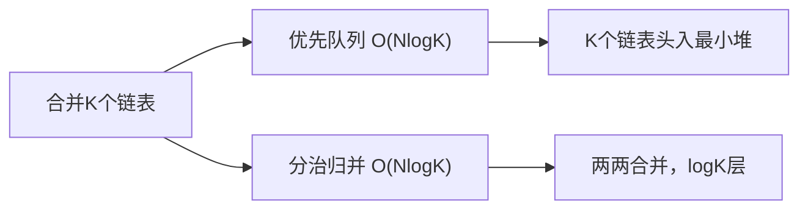

# B006 合并两个有序链表 / B007 合并 K 个升序链表

> LeetCode 21/23 · ⭐/⭐⭐⭐ · 归并 / 优先队列

## B006 合并两个有序链表 (21)

### 01. 题目

`1→2→4, 1→3→4` → `1→1→2→3→4→4`

### 02. 分析

两条有序链表的归并——dummy 节点的经典应用。每次比较两链表头部，取较小的接到结果链。

### 03. 代码

**Java**：
```java
public ListNode mergeTwoLists(ListNode l1, ListNode l2) {
    ListNode dummy = new ListNode(0), cur = dummy;
    while (l1 != null && l2 != null) {
        if (l1.val < l2.val) { cur.next = l1; l1 = l1.next; }
        else { cur.next = l2; l2 = l2.next; }
        cur = cur.next;
    }
    cur.next = l1 != null ? l1 : l2;   // 拼接剩余
    return dummy.next;
}
```

**Python**：
```python
def mergeTwoLists(self, l1, l2):
    dummy = cur = ListNode(0)
    while l1 and l2:
        if l1.val < l2.val: cur.next = l1; l1 = l1.next
        else: cur.next = l2; l2 = l2.next
        cur = cur.next
    cur.next = l1 or l2
    return dummy.next
```

**C++**：
```cpp
ListNode* mergeTwoLists(ListNode* l1, ListNode* l2) {
    ListNode dummy(0), *cur = &dummy;
    while (l1 && l2) {
        if (l1->val < l2->val) { cur->next = l1; l1 = l1->next; }
        else { cur->next = l2; l2 = l2->next; }
        cur = cur->next;
    }
    cur->next = l1 ? l1 : l2;
    return dummy.next;
}
```

**复杂度**：O(m+n)/O(1)。

---

## B007 合并 K 个升序链表 (23)

### 01. 题目

K 个有序链表，合并为一个有序链表。

### 02. 解法对比



| 解法 | 时间 | 空间 | 思路 |
|------|:---:|:---:|------|
| 优先队列 | O(NlogK) | O(K) | 最小堆维护K个链表头 |
| 分治归并 | O(NlogK) | O(logK) | 递归两两合并 |

### 解法一：优先队列

```java
public ListNode mergeKLists(ListNode[] lists) {
    PriorityQueue<ListNode> pq = new PriorityQueue<>((a, b) -> a.val - b.val);
    for (ListNode node : lists) if (node != null) pq.offer(node);
    ListNode dummy = new ListNode(0), cur = dummy;
    while (!pq.isEmpty()) {
        ListNode min = pq.poll();
        cur.next = min; cur = cur.next;
        if (min.next != null) pq.offer(min.next);
    }
    return dummy.next;
}
```

**Python**：
```python
def mergeKLists(self, lists):
    from heapq import heappush, heappop
    ListNode.__lt__ = lambda self, o: self.val < o.val
    heap = []; [heappush(heap, n) for n in lists if n]
    dummy = cur = ListNode(0)
    while heap:
        node = heappop(heap); cur.next = node; cur = cur.next
        if node.next: heappush(heap, node.next)
    return dummy.next
```

### 解法二：分治归并

```java
public ListNode mergeKLists(ListNode[] lists) {
    if (lists.length == 0) return null;
    return divide(lists, 0, lists.length - 1);
}
ListNode divide(ListNode[] lists, int l, int r) {
    if (l == r) return lists[l];
    int m = (l + r) / 2;
    return mergeTwo(divide(lists, l, m), divide(lists, m + 1, r));
}
```

### 03. 总结

| 核心启示 | 说明 |
|---------|------|
| dummy 节点 | 简化头节点处理，所有链表题的基础技巧 |
| 最小堆 | K 路归并的标准解法 |
| 分治 | "合并两个" 复用——化 K 为 2 的递归公式 |

**相关**：[B011 排序链表](011-B-排序链表.md)
