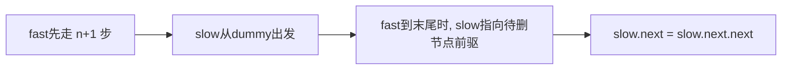

# B008 删除链表的倒数第 N 个结点

> LeetCode 19 · ⭐⭐ · 前后指针

## 01. 题目

`1→2→3→4→5, n=2` → `1→2→3→5`（删除倒数第2个即节点4）

## 02. 题目分析

### 前后指针



### 为什么是 n+1 步？

因为我们需要 `slow` 指向待删节点的**前驱**。

```
dummy → 1 → 2 → 3 → 4 → 5 → null, n=2

fast先走 3 步: dummy → 1 → 2 → 3
                 slow              fast
同步前进直到fast=null:
                 1 → 2 → 3 → 4 → 5 → null
                             slow        fast
slow指向3, slow.next=4 (待删), slow.next.next=5
```

## 03. 代码

**Java**：
```java
public ListNode removeNthFromEnd(ListNode head, int n) {
    ListNode dummy = new ListNode(0, head);
    ListNode fast = dummy, slow = dummy;
    for (int i = 0; i <= n; i++) fast = fast.next;   // 快指针先走 n+1
    while (fast != null) { fast = fast.next; slow = slow.next; }
    slow.next = slow.next.next;
    return dummy.next;
}
```

**Python**：
```python
def removeNthFromEnd(self, head, n):
    dummy = ListNode(0, head)
    fast = slow = dummy
    for _ in range(n + 1): fast = fast.next
    while fast: fast = fast.next; slow = slow.next
    slow.next = slow.next.next
    return dummy.next
```

**C++**：
```cpp
ListNode* removeNthFromEnd(ListNode* head, int n) {
    ListNode dummy(0, head);
    ListNode *fast = &dummy, *slow = &dummy;
    for (int i = 0; i <= n; i++) fast = fast->next;
    while (fast) { fast = fast->next; slow = slow->next; }
    slow->next = slow->next->next;
    return dummy.next;
}
```

**复杂度**：O(N)/O(1)。

## 04. 总结

| 核心要点 | 说明 |
|---------|------|
| fast 先走 n+1 步 | 确保 slow 停在待删节点的前驱 |
| dummy 节点 | 处理删除头节点的边界情况 |
| 前后指针 | 固定间距的同步移动，链表题高频技巧 |

**相关**：[B009 相交链表](009-B-相交链表.md)
