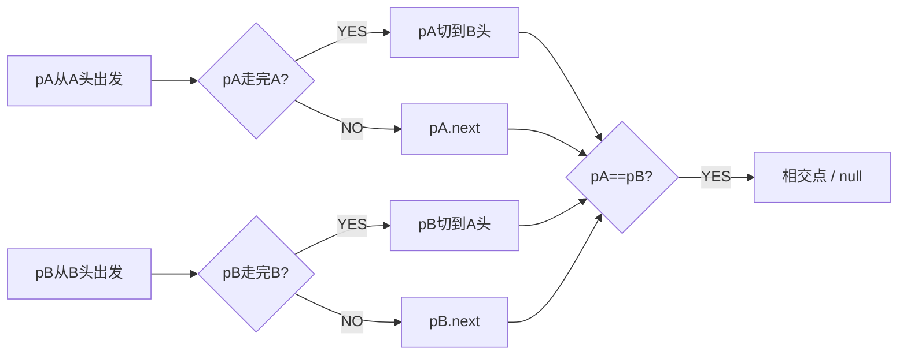

# B009 相交链表（Intersection of Two Linked Lists）

> LeetCode 160 · ⭐ · 双指针
>
> 6 行代码解决一道经典题。"各走 A+B 长度"是链表题的优雅巅峰。

## 01. 题目描述

找出两个单链表相交的起始节点。不相交返回 null。

```
A:  a1 → a2 ↘
              c1 → c2 → c3
B:  b1 → b2 → b3 ↗

输出：c1
```

## 02. 题目分析

### 2.1 为什么各走 A+B 长度会相遇？

```
pA 走完 A 后切换到 B 头
pB 走完 B 后切换到 A 头

总路程：
  pA = A + B = 相交前A + 共用段 + 相交前B + 共用段
  pB = B + A = 相交前B + 共用段 + 相交前A + 共用段

到达相交点时，两者路程相同 → 同时到达！
```



### 2.2 不相交的情况

两指针各走 A+B 步后同时到达 null——`pA == pB == null`，循环退出。

## 03. 代码

**Java**：
```java
public ListNode getIntersectionNode(ListNode headA, ListNode headB) {
    ListNode pA = headA, pB = headB;
    while (pA != pB) {
        pA = pA == null ? headB : pA.next;
        pB = pB == null ? headA : pB.next;
    }
    return pA;
}
```

**Python**：
```python
def getIntersectionNode(self, headA, headB):
    pA, pB = headA, headB
    while pA != pB:
        pA = pA.next if pA else headB
        pB = pB.next if pB else headA
    return pA
```

**C++**：
```cpp
ListNode *getIntersectionNode(ListNode *headA, ListNode *headB) {
    ListNode *pA = headA, *pB = headB;
    while (pA != pB) {
        pA = pA ? pA->next : headB;
        pB = pB ? pB->next : headA;
    }
    return pA;
}
```

**复杂度**：时间 O(m+n)，空间 O(1)。

## 04. 总结

| 核心启示 | 说明 |
|---------|------|
| 消除长度差 | 通过"切换链表"使两指针走相同总路程 |
| 优雅 | 6 行代码，不需要计算长度差 |
| 场景 | 处理链表"对齐"问题的通用技巧 |

**相关**：[B008 删除倒数第N个](008-B-删除链表的倒数第N个结点.md)
