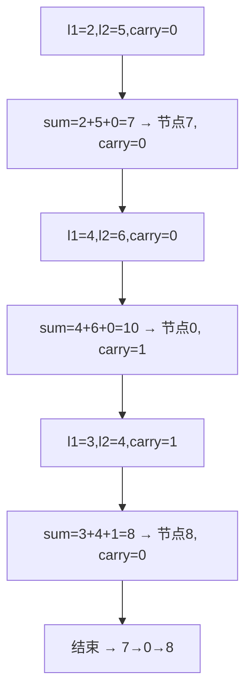

# B013 两数相加（Add Two Numbers）

> LeetCode 2 · ⭐⭐ · 模拟进位

## 01. 题目

两个逆序链表各表示一个非负整数，返回和的链表。`(2→4→3) + (5→6→4)` = `7→0→8`（342+465=807）

## 02. 题目分析

逐位相加，处理进位。while 续条件：`l1!=null || l2!=null || carry>0`。



## 03. 代码

**Java**：
```java
public ListNode addTwoNumbers(ListNode l1, ListNode l2) {
    ListNode dummy = new ListNode(0), cur = dummy;
    int carry = 0;
    while (l1 != null || l2 != null || carry > 0) {
        int sum = carry + (l1 != null ? l1.val : 0) + (l2 != null ? l2.val : 0);
        cur.next = new ListNode(sum % 10);
        carry = sum / 10;
        cur = cur.next;
        if (l1 != null) l1 = l1.next;
        if (l2 != null) l2 = l2.next;
    }
    return dummy.next;
}
```

**Python**：
```python
def addTwoNumbers(self, l1, l2):
    dummy = cur = ListNode(0); carry = 0
    while l1 or l2 or carry:
        s = carry + (l1.val if l1 else 0) + (l2.val if l2 else 0)
        cur.next = ListNode(s % 10); carry = s // 10; cur = cur.next
        l1 = l1.next if l1 else None; l2 = l2.next if l2 else None
    return dummy.next
```

**C++**：
```cpp
ListNode* addTwoNumbers(ListNode* l1, ListNode* l2) {
    ListNode dummy(0), *cur = &dummy; int carry = 0;
    while (l1 || l2 || carry) {
        int s = carry + (l1?l1->val:0) + (l2?l2->val:0);
        cur->next = new ListNode(s % 10); carry = s / 10; cur = cur->next;
        if (l1) l1 = l1->next; if (l2) l2 = l2->next;
    }
    return dummy.next;
}
```

**复杂度**：O(max(m,n))/O(max(m,n))。

**相关**：[A019 字符串相乘](A019-字符串相乘.md)
