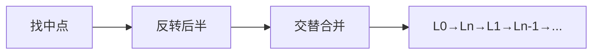

# B014 重排链表（Reorder List）

> LeetCode 143 · ⭐⭐ · 找中点+反转+合并

## 01. 题目

`L0→L1→...→Ln` 重排为 `L0→Ln→L1→Ln-1→...`

## 02. 题目分析



三个基础操作串联：B004 找中点 + B001 反转 + B006 合并。此题展示了链表操作如何像搭积木一样组合。

## 03. 代码

**Java**：
```java
public void reorderList(ListNode head) {
    if (head == null || head.next == null) return;
    // 1. 找中点
    ListNode slow = head, fast = head;
    while (fast != null && fast.next != null) { slow = slow.next; fast = fast.next.next; }
    // 2. 反转后半
    ListNode prev = null, cur = slow.next; slow.next = null;
    while (cur != null) { ListNode nxt = cur.next; cur.next = prev; prev = cur; cur = nxt; }
    // 3. 交替合并
    ListNode p1 = head, p2 = prev;
    while (p2 != null) {
        ListNode n1 = p1.next, n2 = p2.next;
        p1.next = p2; p2.next = n1; p1 = n1; p2 = n2;
    }
}
```

**Python**：
```python
def reorderList(self, head):
    if not head or not head.next: return
    slow = fast = head
    while fast and fast.next: slow, fast = slow.next, fast.next.next
    prev, cur = None, slow.next; slow.next = None
    while cur: nxt = cur.next; cur.next = prev; prev = cur; cur = nxt
    p1, p2 = head, prev
    while p2: n1, n2 = p1.next, p2.next; p1.next = p2; p2.next = n1; p1 = n1; p2 = n2
```

**复杂度**：O(N)/O(1)。

**相关**：[B001 反转链表](001-B-反转链表.md)、[B006 合并有序](006-B-合并两个有序链表.md)
