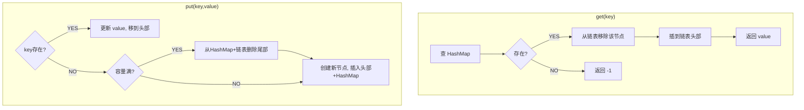

# B015 LRU 缓存（LRU Cache）

> LeetCode 146 · ⭐⭐ · 哈希+双向链表
>
> 面试最常考的设计题，没有之一。两个数据结构取长补短——HashMap 保证 O(1) 查找，双向链表保证 O(1) 插入/删除/移位。这道题考察的是"组合数据结构"的设计思维。

---

## 01. 题目描述

设计 LRU（最近最少使用）缓存。支持：

- `get(key)` → 存在返回值并标记为"最近使用"，否则返回 -1
- `put(key, value)` → 若存在则更新；若容量满则淘汰"最久未使用"的

**示例**：

```
LRUCache cache = new LRUCache(2);
cache.put(1, 1);
cache.put(2, 2);
cache.get(1);       // 返回 1
cache.put(3, 3);    // 淘汰 key=2
cache.get(2);       // 返回 -1
```

**约束**：`get` 和 `put` 必须 O(1)。

---

## 02. 题目分析

### 2.1 数据结构选型

| 操作 | HashMap | 双向链表 | 组合后 |
|------|:---:|:---:|:---:|
| 查找 | O(1) | O(N) | **O(1)** (HashMap) |
| 插入 | O(1) | O(1) | **O(1)** (链表) |
| 删除 | O(1) | O(1) | **O(1)** (链表) |
| 移到头部 | 不支持 | O(1) | **O(1)** (链表) |

HashMap 存 `key → Node` 映射；双向链表维护访问顺序（头部=最近，尾部=最久）。

### 2.2 操作流程



### 2.3 哨兵节点的妙用

头尾各一个 dummy 节点，避免了空链表判断和边界条件处理。

```
head(dummy) ↔ 最近使用 ↔ ... ↔ 最久使用 ↔ tail(dummy)
```

---

## 03. 解法一：手写双向链表+HashMap

**Java**：
```java
class LRUCache {
    class Node { int key, val; Node prev, next; Node(int k, int v) { key=k; val=v; } }

    Map<Integer, Node> map = new HashMap<>();
    Node head = new Node(0, 0), tail = new Node(0, 0);
    int cap;

    public LRUCache(int capacity) {
        cap = capacity;
        head.next = tail; tail.prev = head;
    }

    public int get(int key) {
        if (!map.containsKey(key)) return -1;
        Node node = map.get(key);
        remove(node); addHead(node);       // 移到头部
        return node.val;
    }

    public void put(int key, int value) {
        if (map.containsKey(key)) {
            remove(map.get(key));           // 移除旧节点
        } else if (map.size() == cap) {
            map.remove(tail.prev.key);      // HashMap 也删
            remove(tail.prev);              // 淘汰最久未用
        }
        Node node = new Node(key, value);
        map.put(key, node); addHead(node);
    }

    void remove(Node node) { node.prev.next = node.next; node.next.prev = node.prev; }
    void addHead(Node node) { node.next = head.next; node.prev = head; head.next.prev = node; head.next = node; }
}
```

**Python**：
```python
class Node:
    def __init__(self, k=0, v=0): self.key, self.val = k, v

class LRUCache:
    def __init__(self, cap):
        self.cap = cap; self.map = {}
        self.head = Node(); self.tail = Node()
        self.head.next = self.tail; self.tail.prev = self.head

    def get(self, key):
        if key not in self.map: return -1
        node = self.map[key]
        self._remove(node); self._add_head(node)
        return node.val

    def put(self, key, value):
        if key in self.map: self._remove(self.map[key])
        elif len(self.map) == self.cap:
            del self.map[self.tail.prev.key]
            self._remove(self.tail.prev)
        node = Node(key, value)
        self.map[key] = node; self._add_head(node)

    def _remove(self, node): node.prev.next = node.next; node.next.prev = node.prev
    def _add_head(self, node): node.next = self.head.next; node.prev = self.head; self.head.next.prev = node; self.head.next = node
```

**C++**：
```cpp
class LRUCache {
    struct Node { int key, val; Node *prev, *next; Node(int k=0, int v=0):key(k),val(v),prev(nullptr),next(nullptr){} };
    unordered_map<int, Node*> mp;
    Node *head, *tail; int cap;
public:
    LRUCache(int c) : cap(c) { head=new Node(); tail=new Node(); head->next=tail; tail->prev=head; }
    int get(int k) {
        if(!mp.count(k)) return -1;
        Node *n=mp[k]; remove(n); addHead(n); return n->val;
    }
    void put(int k, int v) {
        if(mp.count(k)){ remove(mp[k]); }
        else if(mp.size()==cap){ mp.erase(tail->prev->key); remove(tail->prev); }
        Node *n=new Node(k,v); mp[k]=n; addHead(n);
    }
    void remove(Node *n){ n->prev->next=n->next; n->next->prev=n->prev; }
    void addHead(Node *n){ n->next=head->next; n->prev=head; head->next->prev=n; head->next=n; }
};
```

**复杂度**：`get` 和 `put` 均 O(1)。

---

## 04. 解法二：Java LinkedHashMap（API 实现）

```java
class LRUCache extends LinkedHashMap<Integer, Integer> {
    int cap;
    LRUCache(int c) { super(c, 0.75f, true); cap = c; }
    int get(int k) { return super.getOrDefault(k, -1); }
    void put(int k, int v) { super.put(k, v); }
    @Override protected boolean removeEldestEntry(Map.Entry e) { return size() > cap; }
}
```

---

## 05. LRU 改进与延伸

| 变体 | 改进点 |
|------|--------|
| LRU-K | 记录最近 K 次访问，防一次性扫描污染缓存 |
| LFU | 按访问频率淘汰，而非最近性 |
| 2Q | 两级队列：刚进入放 hot queue，频繁访问的晋升 |

---

## 06. 总结

| 核心启示 | 说明 |
|---------|------|
| 组合数据结构 | HashMap 解决"查"，双向链表解决"序" |
| 哨兵节点 | dummy head/tail 极大简化边界处理 |
| O(1) 操作 | remove + addHead 两个原子操作组合出 get/put |
| 工业应用 | Redis 内存淘汰、操作系统页面置换、CDN 缓存 |

**相关题目**：[B001 反转链表](001-B-反转链表.md)
