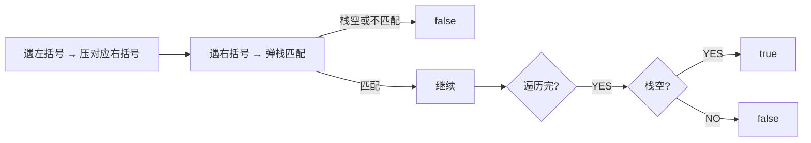

# 有效的括号（Valid Parentheses）

> LeetCode 20 · ⭐ · 栈匹配

## 01. 题目

`"()[]{}"` → true, `"([)]"` → false。括号必须用同类型闭合且顺序正确。

## 02. 题目分析



**技巧**：遇 `([{` 时，不压左括号而压对应的右括号。这样遇 `)]}` 时直接 `pop()==c` 即可，不用查表。

## 03. 代码

**Java**：
```java
public boolean isValid(String s) {
    Deque<Character> stack = new ArrayDeque<>();
    for (char c : s.toCharArray()) {
        if (c == '(') stack.push(')');
        else if (c == '[') stack.push(']');
        else if (c == '{') stack.push('}');
        else if (stack.isEmpty() || stack.pop() != c) return false;
    }
    return stack.isEmpty();
}
```

**Python**：
```python
def isValid(self, s):
    stack, pair = [], {')': '(', ']': '[', '}': '{'}
    for c in s:
        if c in '([{': stack.append(c)
        elif not stack or stack.pop() != pair[c]: return False
    return not stack
```

**C++**：
```cpp
bool isValid(string s) { stack<char> st; for(char c:s){ if(c=='(') st.push(')'); else if(c=='[') st.push(']'); else if(c=='{') st.push('}'); else if(st.empty()||st.top()!=c) return false; else st.pop(); } return st.empty(); }
```

**复杂度**：O(N)/O(N)。

## 04. 思维延伸

**括号匹配的本质是"最近未闭合"——栈的 LIFO 恰好匹配这个语义。这是为什么栈是括号匹配的天然数据结构。**

**相关**：[037 最长有效括号](037.最长有效括号.md)、[038 括号生成](038.括号生成.md)
