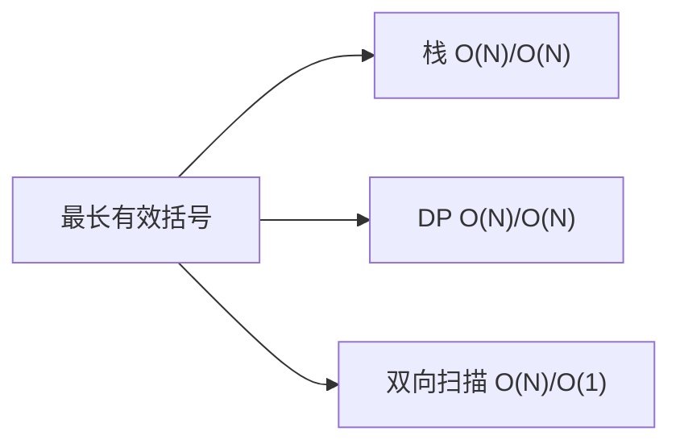

# 最长有效括号（Longest Valid Parentheses）

> LeetCode 32 · ⭐⭐⭐ · 栈 / DP
>
> "最长 + 有效"——双重条件叠加的经典问题。栈解法中，**栈底存最后一个未匹配的右括号下标**是神来之笔。

---

## 01. 题目描述

找出最长有效括号子串的长度。

**示例**：

```
输入：s = "(()"
输出：2  ("()")

输入：s = ")()())"
输出：4  ("()()")

输入：s = ""
输出：0
```

---

## 02. 题目分析

### 2.1 核心问题

有效括号 = `左括号和右括号正确匹配` + `位置连续`。

与 C001"有效的括号"不同之处：C001 只需要判断整个串是否有效，这里需要找"最长的有效子串"。

### 2.2 解法概览



---

## 03. 解法一：栈（存下标）

### 3.1 核心技巧

栈底永远存"最后一个未匹配的右括号下标"。初始化为 -1（虚拟的"未匹配右括号"）。

```
遇 '('：下标入栈
遇 ')'：先弹栈
  - 弹后栈空 → 当前 ')' 未匹配 → 存它的下标
  - 弹后非空 → 当前有效长度 = i - 栈顶
```

### 3.2 手推演示

```
s = ")()())", 栈初始 = [-1]

i=0,')': 弹-1,栈空 → 存0             栈: [0],  max=0
i=1,'(': 入栈1                        栈: [0,1], max=0
i=2,')': 弹1,非空 → 2-0=2            栈: [0],   max=2
i=3,'(': 入栈3                        栈: [0,3], max=2
i=4,')': 弹3,非空 → 4-0=4            栈: [0],   max=4
i=5,')': 弹0,栈空 → 存5             栈: [5],   max=4

答案: 4  ("()()")
```

### 3.3 代码

**Java**：
```java
public int longestValidParentheses(String s) {
    Deque<Integer> stack = new ArrayDeque<>();
    stack.push(-1);
    int max = 0;
    for (int i = 0; i < s.length(); i++) {
        if (s.charAt(i) == '(') {
            stack.push(i);
        } else {
            stack.pop();
            if (stack.isEmpty()) stack.push(i);
            else max = Math.max(max, i - stack.peek());
        }
    }
    return max;
}
```

**Python**：
```python
def longestValidParentheses(self, s: str) -> int:
    stack, mx = [-1], 0
    for i, c in enumerate(s):
        if c == '(': stack.append(i)
        else:
            stack.pop()
            if not stack: stack.append(i)
            else: mx = max(mx, i - stack[-1])
    return mx
```

**C++**：
```cpp
int longestValidParentheses(string s) {
    stack<int> st; st.push(-1); int mx=0;
    for(int i=0;i<s.size();i++){
        if(s[i]=='(') st.push(i);
        else{ st.pop(); if(st.empty()) st.push(i); else mx=max(mx,i-st.top()); }
    }
    return mx;
}
```

**复杂度**：O(N)/O(N)。

---

## 04. 解法二：DP

`dp[i]`：以 i 结尾的最长有效括号长度。

两种转移：
- `s[i]==')' && s[i-1]=='('` → `dp[i] = dp[i-2] + 2`（...() 模式）
- `s[i]==')' && s[i-1]==')'` → 检查 `i-dp[i-1]-1` 是否为 `(`

**Java**：
```java
public int longestValidParentheses(String s) {
    int n = s.length(), max = 0;
    int[] dp = new int[n];
    for (int i = 1; i < n; i++) {
        if (s.charAt(i) == ')') {
            if (s.charAt(i - 1) == '(') {
                dp[i] = (i >= 2 ? dp[i - 2] : 0) + 2;
            } else {
                int j = i - dp[i - 1] - 1;
                if (j >= 0 && s.charAt(j) == '(')
                    dp[i] = dp[i - 1] + 2 + (j >= 1 ? dp[j - 1] : 0);
            }
            max = Math.max(max, dp[i]);
        }
    }
    return max;
}
```

## 05. 解法三：双向扫描（O(1)空间）

从左到右：遇 `(` left++，遇 `)` right++。left==right 时更新。right>left 时归零。
再从右到左同样逻辑。

---

## 06. 三解法对比

| 维度 | 栈 | DP | 双向扫描 |
|------|:---:|:---:|:---:|
| 时间 | O(N) | O(N) | O(N) |
| 空间 | O(N) | O(N) | **O(1)** |
| 直观性 | ⭐⭐⭐ | ⭐⭐ | ⭐⭐⭐⭐ |
| 面试推荐 | ✅ 首选 | 加分项 | 炫技项 |

## 07. 总结

| 核心启示 | 说明 |
|---------|------|
| 栈底存 -1 | 作为"虚拟未匹配右括号"，计算第一个有效段的长度 |
| 弹栈后判断 | 栈空 = 无匹配，不空 = 可计算长度 |
| DP转移 | 分"前一个是("和"前一个是)"两种情况 |

**相关题目**：[036 有效的括号](036.有效的括号.md)、[038 括号生成](038.括号生成.md)
