# 括号生成（Generate Parentheses）

> LeetCode 22 · ⭐⭐ · 回溯

## 01. 题目

生成 n 对括号的所有合法组合。n=3 → `["((()))","(()())","(())()","()(())","()()()"]`

## 02. 题目分析

```mermaid
flowchart TD
    A["(路径, open, close)"] --> B{"open < n?"}
    B -->|YES| C["加 '(' → dfs(open+1, close)"]
    B --> D{"close < open?"}
    D -->|YES| E["加 ')' → dfs(open, close+1)"]
    C --> F{"len == 2n?"}
    E --> F
    F -->|YES| G["收集结果"]
```



**剪枝**：`close < open` 保证合法性——右括号数量不能超过左括号。

## 03. 代码

**Java**：
```java
public List<String> generateParenthesis(int n) {
    List<String> res = new ArrayList<>();
    backtrack(res, new StringBuilder(), 0, 0, n);
    return res;
}
void backtrack(List<String> res, StringBuilder sb, int o, int c, int n) {
    if (sb.length() == 2 * n) { res.add(sb.toString()); return; }
    if (o < n) { sb.append('('); backtrack(res, sb, o+1, c, n); sb.deleteCharAt(sb.length()-1); }
    if (c < o) { sb.append(')'); backtrack(res, sb, o, c+1, n); sb.deleteCharAt(sb.length()-1); }
}
```

**Python**：
```python
def generateParenthesis(self, n):
    res = []
    def dfs(s, o, c):
        if len(s) == 2*n: res.append(s); return
        if o < n: dfs(s+'(', o+1, c)
        if c < o: dfs(s+')', o, c+1)
    dfs('', 0, 0)
    return res
```

**C++**：
```cpp
vector<string> generateParenthesis(int n) { vector<string> res; string cur; function<void(int,int)> dfs=[&](int o,int c){ if(cur.size()==2*n){ res.push_back(cur); return; } if(o<n){ cur+='('; dfs(o+1,c); cur.pop_back(); } if(c<o){ cur+=')'; dfs(o,c+1); cur.pop_back(); } }; dfs(0,0); return res; }
```

**复杂度**：O(4ⁿ/√n)，卡特兰数。**相关**：[036 有效的括号](036.有效的括号.md)
