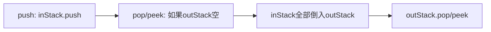

# 用栈实现队列 / 用队列实现栈

> LeetCode 232/225 · ⭐ · 双栈 / 单队列

## 039 用栈实现队列 (232)

### 设计思想

两个栈：`inStack`（接收 push）+ `outStack`（处理 pop/peek）。当 outStack 空时，把 inStack 的全部倒入 outStack——FIFO 就出现了。



**Java**：
```java
class MyQueue {
    Deque<Integer> in = new ArrayDeque<>(), out = new ArrayDeque<>();
    public void push(int x) { in.push(x); }
    public int pop() { ensure(); return out.pop(); }
    public int peek() { ensure(); return out.peek(); }
    public boolean empty() { return in.isEmpty() && out.isEmpty(); }
    void ensure() { if (out.isEmpty()) while (!in.isEmpty()) out.push(in.pop()); }
}
```

**Python**：
```python
class MyQueue:
    def __init__(self): self.in_stack, self.out_stack = [], []
    def push(self, x): self.in_stack.append(x)
    def pop(self): self._ensure(); return self.out_stack.pop()
    def peek(self): self._ensure(); return self.out_stack[-1]
    def empty(self): return not self.in_stack and not self.out_stack
    def _ensure(self):
        if not self.out_stack:
            while self.in_stack: self.out_stack.append(self.in_stack.pop())
```

**摊还 O(1)**：每个元素只被倒一次。

---

## 040 用队列实现栈 (225)

### 单队列旋转法

push 时把新元素前面的所有元素旋转到队尾——使新元素成为队首。

```java
class MyStack {
    Queue<Integer> q = new LinkedList<>();
    public void push(int x) { q.offer(x); for(int i=0;i<q.size()-1;i++) q.offer(q.poll()); }
    public int pop() { return q.poll(); }
    public int top() { return q.peek(); }
    public boolean empty() { return q.isEmpty(); }
}
```

**Python**：
```python
class MyStack:
    def __init__(self): self.q = deque()
    def push(self, x): self.q.append(x); [self.q.append(self.q.popleft()) for _ in range(len(self.q)-1)]
    def pop(self): return self.q.popleft()
    def top(self): return self.q[0]
    def empty(self): return not self.q
```

| | 栈→队列 | 队列→栈 |
|------|:---:|:---:|
| 核心 | 双栈+摊还 | 旋转法 |
| push | O(1) | **O(N)** |
| pop/peek | 摊还 O(1) | O(1) |
