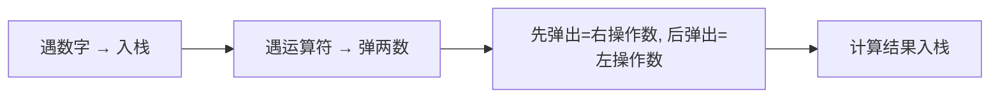

# 逆波兰表达式求值（Evaluate Reverse Polish Notation）

> LeetCode 150 · ⭐⭐ · 后缀表达式

## 01. 题目

`["2","1","+","3","*"]` → 9（即 (2+1)×3=9）

## 02. 题目分析

后缀表达式无需括号就能唯一确定运算顺序——这正是栈的天然场景。



**注意**：**先弹出的是右操作数**（减法除法顺序敏感）。

## 03. 代码

**Java**：
```java
public int evalRPN(String[] tokens) {
    Deque<Integer> stack = new ArrayDeque<>();
    for (String t : tokens) {
        switch (t) {
            case "+": stack.push(stack.pop() + stack.pop()); break;
            case "-": int b = stack.pop(), a = stack.pop(); stack.push(a - b); break;
            case "*": stack.push(stack.pop() * stack.pop()); break;
            case "/": int d = stack.pop(), c = stack.pop(); stack.push(c / d); break;
            default: stack.push(Integer.parseInt(t));
        }
    }
    return stack.pop();
}
```

**Python**：
```python
def evalRPN(self, tokens):
    stack, ops = [], {'+': lambda a,b: a+b, '-': lambda a,b: a-b, '*': lambda a,b: a*b, '/': lambda a,b: int(a/b)}
    for t in tokens:
        if t in ops: b,a=stack.pop(),stack.pop(); stack.append(ops[t](a,b))
        else: stack.append(int(t))
    return stack[0]
```

**C++**：
```cpp
int evalRPN(vector<string>& t) { stack<int> st; for(auto& s:t){ if(s=="+"){ int b=st.top();st.pop(); st.top()+=b; } else if(s=="-"){ int b=st.top();st.pop(); st.top()-=b; } else if(s=="*"){ int b=st.top();st.pop(); st.top()*=b; } else if(s=="/"){ int b=st.top();st.pop(); st.top()/=b; } else st.push(stoi(s)); } return st.top(); }
```

**复杂度**：O(N)/O(N)。**相关**：[043 基本计算器II](043.基本计算器II.md)
