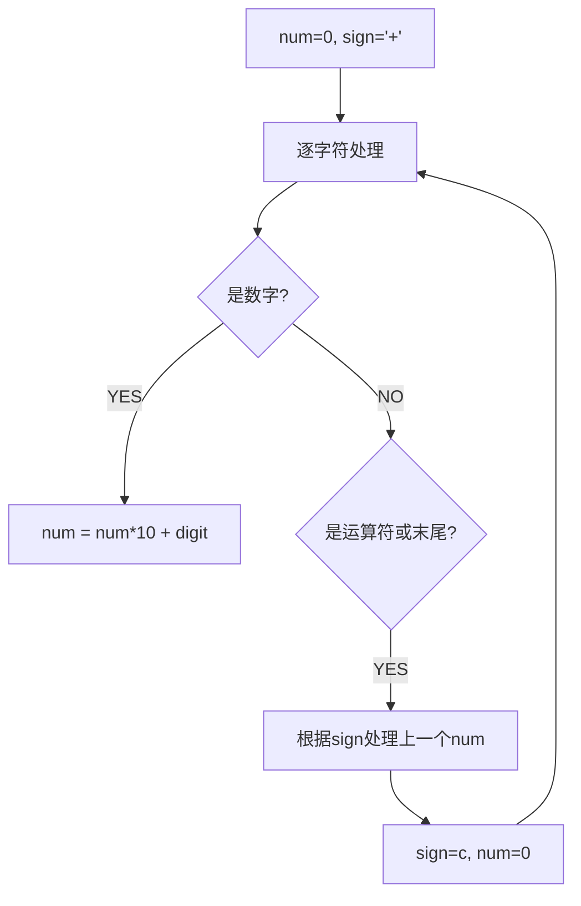

# 基本计算器 II（Basic Calculator II）

> LeetCode 227 · ⭐⭐ · 栈模拟运算

## 01. 题目

`"3+2*2"` → 7, `" 3/2 "` → 1（加减乘除，无括号，非负整数）

## 02. 题目分析

### 核心困难：运算符优先级

`+` 和 `-` 可以直接算（同级），`×` 和 `÷` 优先级更高——必须先算。

### 巧妙解法：延迟计算

```
当前运算符决定的是"上一个数"的命运：

sign='+' → 直接入栈 num
sign='-' → 入栈 -num
sign='*' → 弹栈顶 × num 入栈
sign='/' → 弹栈顶 / num 入栈

最后把栈内所有数求和
```



## 03. 代码

**Java**：
```java
public int calculate(String s) {
    Deque<Integer> stack = new ArrayDeque<>();
    int num = 0; char sign = '+';
    for (int i = 0; i < s.length(); i++) {
        char c = s.charAt(i);
        if (Character.isDigit(c)) num = num * 10 + (c - '0');
        if ((!Character.isDigit(c) && c != ' ') || i == s.length() - 1) {
            switch (sign) {
                case '+': stack.push(num); break;
                case '-': stack.push(-num); break;
                case '*': stack.push(stack.pop() * num); break;
                case '/': stack.push(stack.pop() / num); break;
            }
            sign = c; num = 0;
        }
    }
    return stack.stream().mapToInt(Integer::intValue).sum();
}
```

**Python**：
```python
def calculate(self, s):
    stack, num, sign = [], 0, '+'
    for i, c in enumerate(s):
        if c.isdigit(): num = num*10 + int(c)
        if c in '+-*/' or i == len(s)-1:
            if sign == '+': stack.append(num)
            elif sign == '-': stack.append(-num)
            elif sign == '*': stack.append(stack.pop() * num)
            elif sign == '/': stack.append(int(stack.pop() / num))
            sign, num = c, 0
    return sum(stack)
```

**C++**：
```cpp
int calculate(string s) { stack<int> st; int num=0; char sign='+'; for(int i=0;i<s.size();i++){ char c=s[i]; if(isdigit(c)) num=num*10+(c-'0'); if((!isdigit(c)&&c!=' ')||i==s.size()-1){ if(sign=='+') st.push(num); else if(sign=='-') st.push(-num); else if(sign=='*'){ num*=st.top();st.pop();st.push(num); } else{ num=st.top()/num;st.pop();st.push(num); } sign=c;num=0; } } int ans=0; while(!st.empty()){ ans+=st.top();st.pop(); } return ans; }
```

**复杂度**：O(N)/O(N)。

## 04. 总结

| 核心 | 说明 |
|------|------|
| 延迟计算 | 当前运算符决定上一个数的去向 |
| 优先级 | ×÷ 弹栈先算，+- 直接入栈 |
| 最后求和 | 栈内所有元素求和 = 最终结果 |

**相关**：[042 逆波兰](042.逆波兰表达式求值.md)
