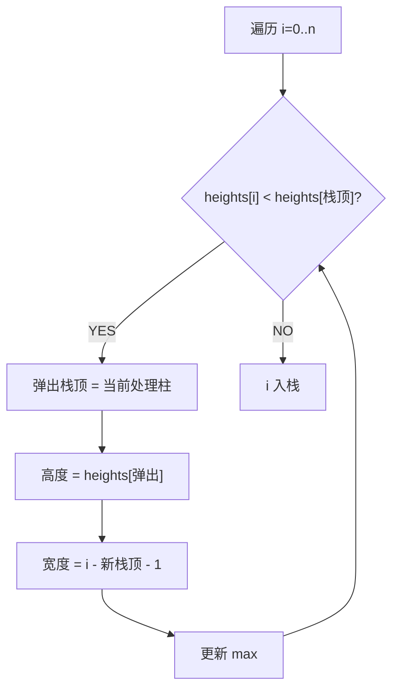
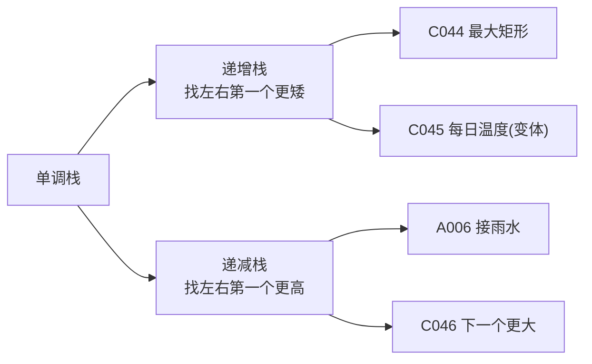

# 柱状图中最大的矩形（Largest Rectangle in Histogram）

> LeetCode 84 · ⭐⭐⭐ · 单调栈
>
> 单调栈的"第二经典题"——与接雨水是镜像关系。接雨水求"凹槽"，柱状图求"凸起"。理解这道题，才算真正掌握了单调栈的范式思维。

---

## 01. 题目描述

给定 `heights`，求其中能勾勒出的最大矩形面积。

**示例**：

```
输入：heights = [2,1,5,6,2,3]
输出：10
解释：最大矩形是高度为 5 和 6 的部分，面积 = 5 × 2(宽) = 10
```

```
直观图示：
    █
  █ █
  █ █   █
█ █ █ █ █
█ █ █ █ █
2 1 5 6 2 3

最大矩形 = 5×2 = 10 (heights[2]=5, heights[3]=6, 宽=2)
```

**约束**：`1 <= heights.length <= 10^5`，`0 <= heights[i] <= 10^4`

---

## 02. 题目分析：每个柱子的"势力范围"

### 2.1 核心公式

对每个柱子 `i`，以它的高度能延伸的最大矩形：

$$area[i] = heights[i] \times (rightSmaller[i] - leftSmaller[i] - 1)$$

其中 `rightSmaller[i]` 是 i 右端第一个比它矮的柱子下标，`leftSmaller[i]` 同理。

```
以 heights[2]=5 为例：
  leftSmaller=1 (heights[1]=1<5)
  rightSmaller=4 (heights[4]=2<5)
  width = 4 - 1 - 1 = 2
  area = 5 × 2 = 10
```

### 2.2 朴素做法：O(N²)

对每个柱子 i，向左右扫描找第一个比它矮的。N=10⁵ → 10¹⁰ 超时。

### 2.3 单调栈：O(N)

维护单调递增栈（存下标）。遇到较矮柱子时弹栈——此时弹出的柱子找到了它的**右边界**。



### 2.4 与接雨水的镜像关系

| | 接雨水 | 柱状图最大矩形 |
|------|:---:|:---:|
| 形状 | 凹槽 ↓ | 凸起 ↑ |
| 单调栈类型 | 递减栈 | **递增栈** |
| 弹出时机 | 遇到更高 | 遇到更矮 |
| 计算目标 | 水量 (宽×深) | 面积 (宽×高) |

---

## 03. 单调栈解法（O(N)）

### 3.1 手推演示

```
heights = [2, 1, 5, 6, 2, 3], 末尾加哨兵 0

i=0,h=2: 栈空 → 入栈        栈: [0]
i=1,h=1: 1<2 → 弹出0: 高2, 宽1-(-1)-1=1, area=2   栈: []
         入栈 1              栈: [1]
i=2,h=5: 5>1 → 入栈 2       栈: [1,2]
i=3,h=6: 6>5 → 入栈 3       栈: [1,2,3]
i=4,h=2: 2<6 → 弹出3: 高6, 宽4-2-1=1, area=6       栈: [1,2]
         2<5 → 弹出2: 高5, 宽4-1-1=2, area=10 ←max 栈: [1]
         2>1 → 入栈 4       栈: [1,4]
i=5,h=3: 3>2 → 入栈 5       栈: [1,4,5]
i=6,h=0: 0<3 → 弹出5: 高3, 宽6-4-1=1, area=3
         0<2 → 弹出4: 高2, 宽6-1-1=4, area=8
         0<1 → 弹出1: 高1, 宽6-(-1)-1=6, area=6

max = 10
```

### 3.2 哨兵的作用

`heights` 末尾追加 `0`：确保所有元素都被弹出处理。否则最后一段递增序列无法计算。

### 3.3 代码

**Java**：
```java
public int largestRectangleArea(int[] heights) {
    int n = heights.length, max = 0;
    Deque<Integer> stack = new ArrayDeque<>();
    for (int i = 0; i <= n; i++) {
        int h = (i == n) ? 0 : heights[i];          // 哨兵
        while (!stack.isEmpty() && h < heights[stack.peek()]) {
            int height = heights[stack.pop()];
            int width = stack.isEmpty() ? i : i - stack.peek() - 1;
            max = Math.max(max, height * width);
        }
        stack.push(i);
    }
    return max;
}
```

**Python**：
```python
def largestRectangleArea(self, heights: List[int]) -> int:
    stack, ans = [], 0
    heights.append(0)               # 哨兵
    for i, h in enumerate(heights):
        while stack and h < heights[stack[-1]]:
            height = heights[stack.pop()]
            width = i if not stack else i - stack[-1] - 1
            ans = max(ans, height * width)
        stack.append(i)
    return ans
```

**C++**：
```cpp
int largestRectangleArea(vector<int>& heights) {
    heights.push_back(0);            // 哨兵
    stack<int> st; int ans = 0;
    for (int i = 0; i < heights.size(); i++) {
        while (!st.empty() && heights[i] < heights[st.top()]) {
            int h = heights[st.top()]; st.pop();
            int w = st.empty() ? i : i - st.top() - 1;
            ans = max(ans, h * w);
        }
        st.push(i);
    }
    return ans;
}
```

**复杂度**：时间 O(N)，每个元素最多入栈出栈各一次。空间 O(N)。

---

## 04. 单调栈题型总结



| 题目 | 栈类型 | 弹出条件 | 计算什么 |
|------|:---:|---------|---------|
| A006 接雨水 | 递减栈 | `h > top` | 凹槽水量 |
| **C044 最大矩形** | **递增栈** | `h < top` | 矩形面积 |
| C045 每日温度 | 递减栈 | `t > top` | 等待天数 |
| C046 下一个更大 | 递减栈 | `n > top` | 下一个更大 |

---

## 05. 总结

| 核心启示 | 说明 |
|---------|------|
| 递增栈=找更矮 | 遇到更矮时弹栈，弹栈节点找到了右边界 |
| 宽度计算 | `width = i - 新栈顶 - 1`（或 `i` 若栈空） |
| 哨兵 0 | 末尾加 0 确保所有元素被弹出 |
| 与接雨水镜像 | 递增栈 vs 递减栈，凸起 vs 凹槽 |

**相关题目**：[045 每日温度](045.每日温度.md)、[接雨水](../07.数组算法题/006.接雨水.md)
