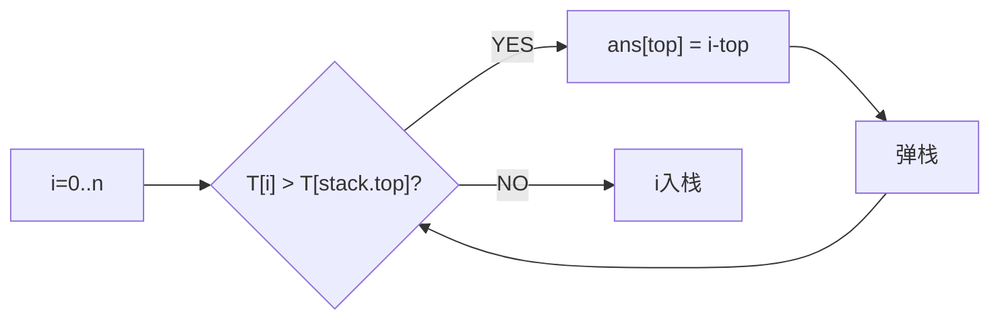

# 每日温度（Daily Temperatures）

> LeetCode 739 · ⭐⭐ · 单调栈

## 01. 题目

`[73,74,75,71,69,72,76,73]` → `[1,1,4,2,1,1,0,0]`（每个元素等几天才能遇到更高温度）

## 02. 题目分析

### 单调递减栈

栈存下标，温度递减。遇更高温度时弹栈——弹栈元素找到了"下一个更高温度"。



### 手推

```
T=[73,74,75,71,69,72,76,73]

i=0,T=73: 栈空 → 入栈          栈=[0]
i=1,T=74: 74>73 → ans[0]=1,弹0  栈=[] → 入栈1  栈=[1]
i=2,T=75: 75>74 → ans[1]=1,弹1  栈=[] → 入栈2  栈=[2]
i=3,T=71: 71<75 → 入栈3          栈=[2,3]
i=4,T=69: 69<71 → 入栈4          栈=[2,3,4]
i=5,T=72: 72>69 → ans[4]=1,弹4
          72>71 → ans[3]=2,弹3
          72<75 → 入栈5          栈=[2,5]
i=6,T=76: 76>72 → ans[5]=1,弹5
          76>75 → ans[2]=4,弹2   栈=[] → 入栈6
i=7,T=73: 73<76 → 入栈7

结果：[1,1,4,2,1,1,0,0]
```

## 03. 代码

**Java**：
```java
public int[] dailyTemperatures(int[] T) {
    int n=T.length; int[] ans=new int[n];
    Deque<Integer> stack=new ArrayDeque<>();
    for(int i=0;i<n;i++){
        while(!stack.isEmpty()&&T[i]>T[stack.peek()]){
            int prev=stack.pop(); ans[prev]=i-prev;
        }
        stack.push(i);
    }
    return ans;
}
```

**Python**：
```python
def dailyTemperatures(self, T):
    ans,stack=[0]*len(T),[]
    for i,t in enumerate(T):
        while stack and t>T[stack[-1]]: prev=stack.pop(); ans[prev]=i-prev
        stack.append(i)
    return ans
```

**C++**：
```cpp
vector<int> dailyTemperatures(vector<int>& T) {
    int n=T.size(); vector<int> ans(n); stack<int> st;
    for(int i=0;i<n;i++){ while(!st.empty()&&T[i]>T[st.top()]){ ans[st.top()]=i-st.top(); st.pop(); } st.push(i); }
    return ans;
}
```

**复杂度**：O(N)/O(N)。

## 04. 单调栈题型与栈类型

| 题目 | 栈类型 | 找什么 | 计算什么 |
|------|:---:|------|------|
| C045 每日温度 | **递减** | 下一个更高 | 等了几天 |
| C046 下一个更大 | **递减** | 下一个更大 | 更大的值 |
| A006 接雨水 | **递减** | 下一个更高 | 凹槽水量 |
| C044 最大矩形 | **递增** | 下一个更矮 | 矩形面积 |

**相关**：[046 下一个更大](046.下一个更大元素II.md)、[044 最大矩形](044.柱状图中最大的矩形.md)
