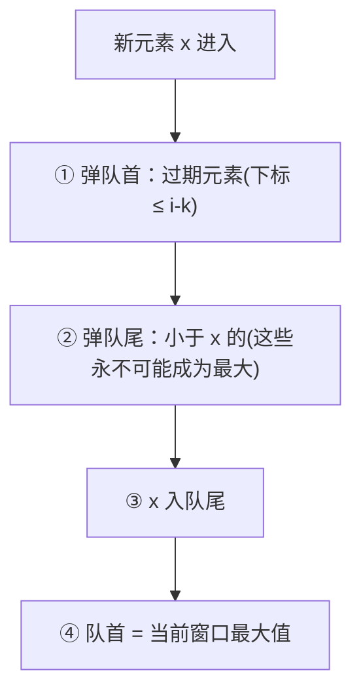
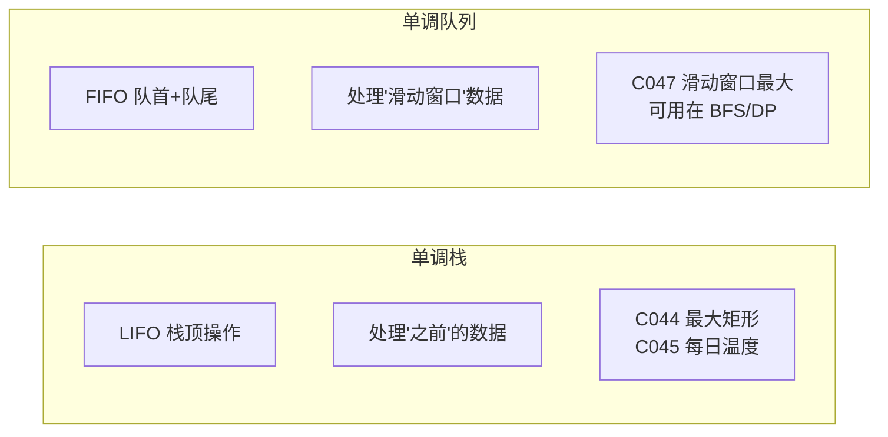

# 滑动窗口最大值（Sliding Window Maximum）

> LeetCode 239 · ⭐⭐⭐ · 单调队列
>
> 单调栈处理"以前"的数据，单调队列处理"滑动"的数据。队首始终是当前窗口的最大值——但如何高效剔除"过期"元素和"无用"元素？

---

## 01. 题目描述

给定数组 `nums` 和窗口大小 `k`，返回每个滑动窗口的最大值。

**示例**：

```
输入：nums = [1,3,-1,-3,5,3,6,7], k = 3
输出：[3,3,5,5,6,7]

窗口位置              最大值
[1  3  -1] -3  5  3  6  7    3
 1 [3  -1  -3] 5  3  6  7    3
 1  3 [-1  -3  5] 3  6  7    5
 1  3  -1 [-3  5  3] 6  7    5
 1  3  -1  -3 [5  3  6] 7    6
 1  3  -1  -3  5 [3  6  7]   7
```

**约束**：`1 <= k <= nums.length <= 10^5`

---

## 02. 题目分析

### 2.1 朴素做法：O(NK)

每次窗口移动，扫描 K 个元素找最大值。N=10⁵ → O(NK) 必超时。

### 2.2 为什么需要队列？

窗口滑动 = 新元素进来 + 旧元素出去。这就是队列的语义（FIFO）。

### 2.3 为什么需要"单调"？

普通队列只能存取元素，不能 O(1) 获取最大值。**单调队列**：队首始终是窗口内最大值，队尾用来"淘汰"无用元素。



### 2.4 为什么可以"弹队尾"？

如果一个元素 `x` 比之前的元素大，且比它们更靠右，那些之前的元素**永远不可能成为窗口内的最大值**——因为 x 更大且更晚过期。

```
窗口 k=3: [1, 3, -1]

队列状态：
i=0,x=1: dq=[1]
i=1,x=3: 3>1 → 弹出1, dq=[3]
i=2,x=-1: -1<3 → dq=[3,-1]
        队首=3,窗口[1,3,-1] max=3 ✓

i=3,x=-3: 1不在窗口 → 弹队首, dq=[3,-1,-3]
        队首=3,窗口[3,-1,-3] max=3 ✓
```

---

## 03. 解法一：单调队列（O(N)）

### 3.1 核心操作

| 操作 | 代码 | 目的 |
|------|------|------|
| 弹队首 | `if(dq[0] <= i-k) pollFirst()` | 剔除过期元素 |
| 弹队尾 | `while(dq[-1] < x) pollLast()` | 剔除无用元素 |
| 取队首 | `nums[dq[0]]` | 当前窗口最大值 |

### 3.2 代码

**Java**：
```java
public int[] maxSlidingWindow(int[] nums, int k) {
    int n = nums.length;
    int[] ans = new int[n - k + 1];
    Deque<Integer> dq = new ArrayDeque<>();   // 存下标，值递减

    for (int i = 0; i < n; i++) {
        // ① 弹队首：移除窗口外的元素
        if (!dq.isEmpty() && dq.peekFirst() <= i - k)
            dq.pollFirst();
        // ② 弹队尾：移除所有小于当前值的（它们永不可能成最大）
        while (!dq.isEmpty() && nums[i] >= nums[dq.peekLast()])
            dq.pollLast();
        // ③ 当前元素入队
        dq.offerLast(i);
        // ④ 记录窗口最大值（队首）
        if (i >= k - 1)
            ans[i - k + 1] = nums[dq.peekFirst()];
    }
    return ans;
}
```

**Python**：
```python
def maxSlidingWindow(self, nums: List[int], k: int) -> List[int]:
    from collections import deque
    dq = deque()
    ans = []
    for i, x in enumerate(nums):
        if dq and dq[0] <= i - k:      # 弹过期
            dq.popleft()
        while dq and nums[dq[-1]] <= x: # 弹无用
            dq.pop()
        dq.append(i)                     # 入队
        if i >= k - 1:
            ans.append(nums[dq[0]])      # 队首=最大
    return ans
```

**C++**：
```cpp
vector<int> maxSlidingWindow(vector<int>& nums, int k) {
    deque<int> dq;
    vector<int> ans;
    for (int i = 0; i < nums.size(); i++) {
        if (!dq.empty() && dq.front() <= i - k) dq.pop_front();
        while (!dq.empty() && nums[i] >= nums[dq.back()]) dq.pop_back();
        dq.push_back(i);
        if (i >= k - 1) ans.push_back(nums[dq.front()]);
    }
    return ans;
}
```

**复杂度**：时间 O(N)，每个元素最多入队出队各一次。空间 O(K)。

---

## 04. 单调栈 vs 单调队列



| | 单调栈 | 单调队列 |
|------|:---:|:---:|
| 数据结构 | Deque 当栈用 | Deque 当队列用 |
| 操作端点 | 仅栈顶 | 队首(过期) + 队尾(无用) |
| 典型题 | 接雨水、最大矩形 | 滑动窗口最大/最小 |
| 核心操作 | `push/pop` | `offerLast/pollFirst/pollLast` |

---

## 05. 总结

| 核心启示 | 说明 |
|---------|------|
| 弹队尾淘汰 | "更大且更靠右"的元素使之前的元素"永无出头之日" |
| 弹队首过期 | 窗口滑动后，队首元素可能已不在窗口内 |
| 队首即答案 | 单调递减队列 → 队首 = 最大值 |
| 复杂度分析 | 每个元素最多入队一次、出队一次 → O(N) |

**相关题目**：[045 每日温度](045.每日温度.md)、[046 下一个更大](046.下一个更大元素II.md)
