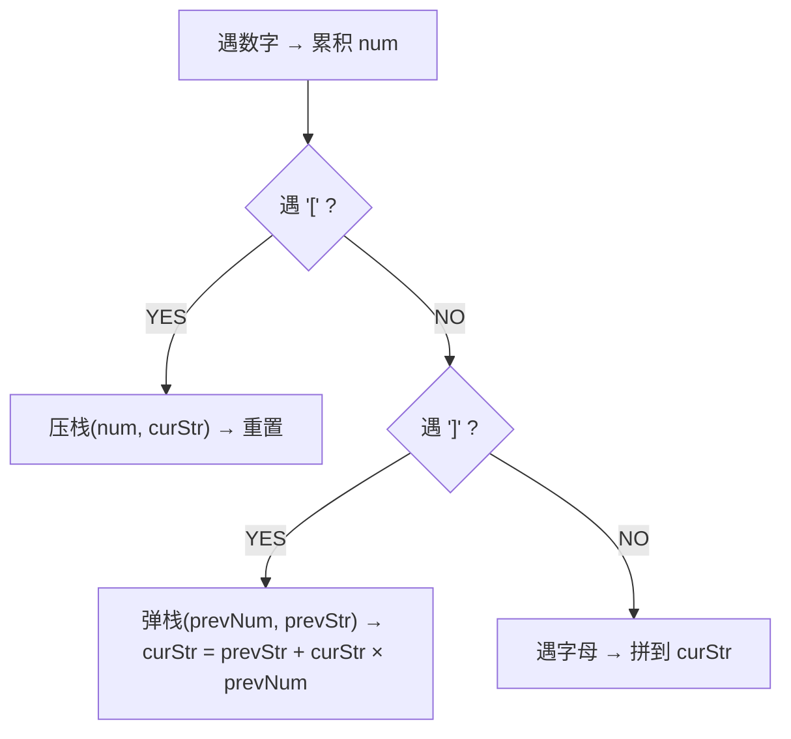

# 字符串解码（Decode String）

> LeetCode 394 · ⭐⭐ · 栈处理嵌套结构

## 01. 题目

`"3[a2[c]]"` → `"accaccacc"`（嵌套解码：先内层 `2[c]=cc`，再外层 `3[acc]=accaccacc`）

## 02. 题目分析



## 03. 代码

**Java**：
```java
public String decodeString(String s) {
    Deque<Integer> numStack = new ArrayDeque<>();
    Deque<StringBuilder> strStack = new ArrayDeque<>();
    StringBuilder cur = new StringBuilder();
    int num = 0;
    for (char c : s.toCharArray()) {
        if (Character.isDigit(c)) num = num * 10 + (c - '0');
        else if (c == '[') { numStack.push(num); strStack.push(cur); num = 0; cur = new StringBuilder(); }
        else if (c == ']') { int k = numStack.pop(); StringBuilder prev = strStack.pop(); while (k-- > 0) prev.append(cur); cur = prev; }
        else cur.append(c);
    }
    return cur.toString();
}
```

**Python**：
```python
def decodeString(self, s):
    stack, cur_num, cur_str = [], 0, ''
    for c in s:
        if c.isdigit(): cur_num = cur_num*10 + int(c)
        elif c == '[': stack.append((cur_str, cur_num)); cur_str, cur_num = '', 0
        elif c == ']': prev_str, num = stack.pop(); cur_str = prev_str + cur_str * num
        else: cur_str += c
    return cur_str
```

**C++**：
```cpp
string decodeString(string s) { stack<pair<string,int>> st; string cur; int num=0; for(char c:s){ if(isdigit(c)) num=num*10+(c-'0'); else if(c=='['){ st.push({cur,num}); cur="";num=0; } else if(c==']'){ auto[prev,k]=st.top();st.pop(); string tmp=cur; cur=prev; while(k--) cur+=tmp; } else cur+=c; } return cur; }
```

**复杂度**：O(N×maxK)/O(N)。

**相关**：[036 有效的括号](036.有效的括号.md)
