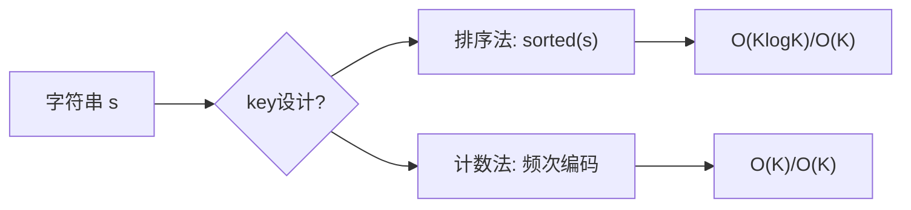

# 字母异位词分组（Group Anagrams）

> LeetCode 49 · ⭐⭐ · 哈希+排序/计数

## 01. 题目

`["eat","tea","tan","ate","nat","bat"]` → `[["bat"],["nat","tan"],["ate","eat","tea"]]`

## 02. 题目分析

### 核心：如何设计 key？

字母异位词 → 字符频次相同。需要一种将"频次"编码为唯一 key 的方法。



| 方法 | key 示例 | 时间 |
|------|------|:---:|
| 排序 | `"eat"→"aet"` | O(KlogK) |
| 计数编码 | `"eat"→"1#0#0#0#1#..."` | O(K) |

## 03. 代码

**Java**（排序法）：
```java
public List<List<String>> groupAnagrams(String[] strs) {
    Map<String, List<String>> map = new HashMap<>();
    for (String s : strs) {
        char[] arr = s.toCharArray(); Arrays.sort(arr);
        String key = new String(arr);
        map.computeIfAbsent(key, k -> new ArrayList<>()).add(s);
    }
    return new ArrayList<>(map.values());
}
```

**Python**（排序法）：
```python
def groupAnagrams(self, strs):
    from collections import defaultdict
    mp = defaultdict(list)
    for s in strs: mp[''.join(sorted(s))].append(s)
    return list(mp.values())
```

**C++**：
```cpp
vector<vector<string>> groupAnagrams(vector<string>& strs) {
    unordered_map<string, vector<string>> mp;
    for (auto& s : strs) { string k = s; sort(k.begin(), k.end()); mp[k].push_back(s); }
    vector<vector<string>> res;
    for (auto& p : mp) res.push_back(p.second);
    return res;
}
```

**复杂度**：O(N·KlogK)/O(NK)。

## 04. 总结

| 核心 | 说明 |
|------|------|
| key 设计 | 排序后的字符串 = 字母异位词的标准表示 |
| HashMap | key → List 的自然映射 |
| 变体 | 也可用计数数组编码作为 key |

**相关题目**：[058 字符频率排序](058.根据字符出现频率排序.md)
