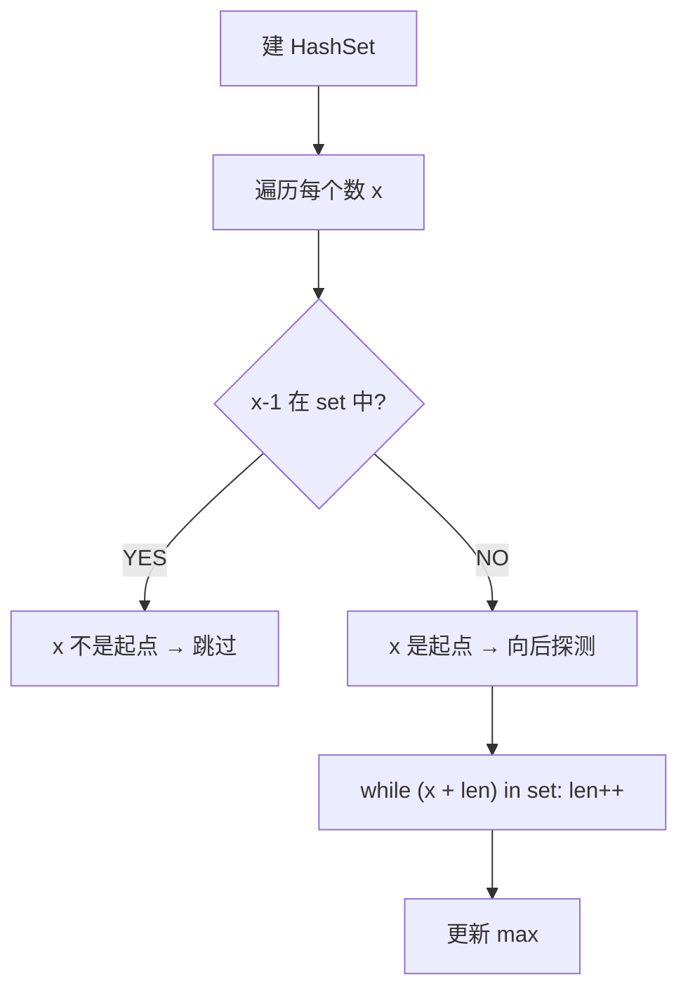

# 最长连续序列（Longest Consecutive Sequence）

> LeetCode 128 · ⭐⭐ · 哈希+边界探测
>
> 要求 O(N) 时间。排序法 O(NlogN) 不行。"只有起点才向后探测"——一次 O(1) 的判断避免了 O(N²) 的膨胀。

---

## 01. 题目描述

给定未排序的整数数组，找出最长连续序列的长度。要求 O(N) 时间。

**示例**：

```
输入：nums = [100,4,200,1,3,2]
输出：4
解释：最长连续序列是 [1,2,3,4]，长度 4
```

**示例 2**：

```
输入：nums = [0,3,7,2,5,8,4,6,0,1]
输出：9     ([0,1,2,3,4,5,6,7,8])
```

---

## 02. 题目分析

### 2.1 朴素思路的陷阱

| 思路 | 时间 | 问题 |
|------|:---:|------|
| 排序+扫描 | O(NlogN) | 不满足 O(N) |
| 每个数向后探测 | O(N²) | 大量重复探测 |
| 并查集 | O(N·α(N)) | 过于复杂 |

### 2.2 关键洞察：只从"起点"探测

什么是一个连续序列的起点？——**它的前驱不在集合中**。



**复杂度证明**：每个数最多被访问两次（一次作为起点判断，一次在探测中被访问）→ O(N)。

### 2.3 手推演示

```
nums = [100, 4, 200, 1, 3, 2]
set = {100, 4, 200, 1, 3, 2}

x=100: 99 not in set → 起点!
       while 101?× → len=1, max=1
x=4:   3 in set → 不是起点（skip）
x=200: 199 not in set → 起点!
       while 201?× → len=1, max=1
x=1:   0 not in set → 起点!
       while 2?✓, 3?✓, 4?✓ → len=4, max=4
x=3:   2 in set → skip
x=2:   1 in set → skip

结果：4 (序列 [1,2,3,4])
```

---

## 03. 代码

**Java**：
```java
public int longestConsecutive(int[] nums) {
    Set<Integer> set = new HashSet<>();
    for (int n : nums) set.add(n);          // O(N) 建集合
    int max = 0;
    for (int x : set) {                     // 遍历集合（非数组，已去重）
        if (!set.contains(x - 1)) {         // x 是起点
            int cur = x, len = 1;
            while (set.contains(cur + 1)) {
                cur++; len++;
            }
            max = Math.max(max, len);
        }
    }
    return max;
}
```

**Python**：
```python
def longestConsecutive(self, nums: List[int]) -> int:
    s = set(nums)
    ans = 0
    for x in s:
        if x - 1 not in s:                   # 只从起点开始
            y = x + 1
            while y in s:
                y += 1
            ans = max(ans, y - x)
    return ans
```

**C++**：
```cpp
int longestConsecutive(vector<int>& nums) {
    unordered_set<int> s(nums.begin(), nums.end());
    int ans = 0;
    for (int x : s) {
        if (!s.count(x - 1)) {               // 起点
            int cur = x;
            while (s.count(cur + 1)) cur++;
            ans = max(ans, cur - x + 1);
        }
    }
    return ans;
}
```

**复杂度**：时间 O(N)，每个数最多被访问两次。空间 O(N)。

---

## 04. 哈希表的作用

| 操作 | 复杂度 | 如何达成 |
|------|:---:|------|
| 建集合 | O(N) | 遍历一次 |
| 判断"x-1 存在?" | O(1) | HashSet |
| 向后探测 | 摊还 O(1) | 每个数最多被探测一次 |

**关键**：HashSet 的 O(1) 查找 + "只从起点探测"的剪枝 = O(N) 总复杂度。

---

## 05. 总结

| 核心启示 | 说明 |
|---------|------|
| 起点判断 | `x-1 in set` → O(1) 判断，避免 O(N²) 膨胀 |
| 摊还 O(N) | 每个元素最多出现在一段探测中 |
| 哈希场景 | 序列关系（前驱/后继）的 O(1) 查询 |

**相关题目**：[053 缺失的第一个正数](053.缺失的第一个正数.md)
