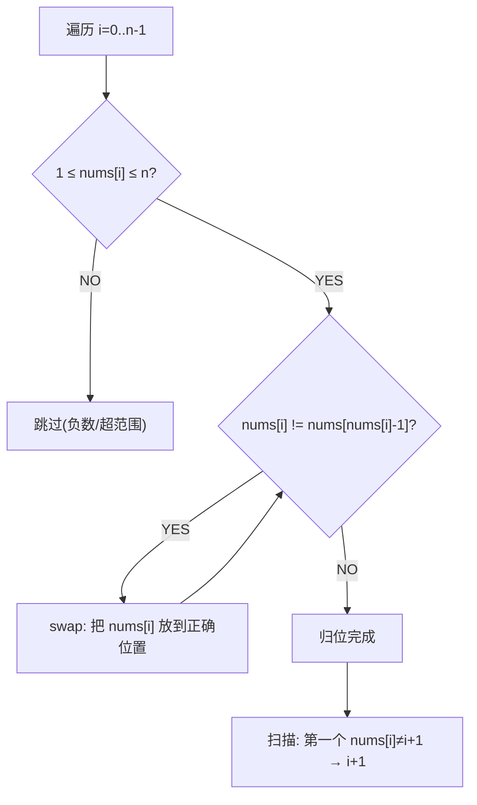

# 缺失的第一个正数（First Missing Positive）

> LeetCode 41 · ⭐⭐⭐ · 原地哈希
>
> O(N) 时间 + O(1) 空间。"把每个数放到它该在的位置上"——这是 O(1) 空间哈希的核心思想。

---

## 01. 题目描述

找出数组中没有出现的最小正整数。要求 O(N) 时间、O(1) 空间。

**示例**：

```
输入：[1,2,0]          → 3
输入：[3,4,-1,1]       → 2
输入：[7,8,9,11,12]    → 1
```

---

## 02. 题目分析

### 2.1 答案范围

$$答案 \in [1, n+1]$$

为什么？数组中最多有 n 个元素。如果 1,2,...,n 都存在，答案是 n+1。如果某个 1..n 缺失，答案就是那个数。

### 2.2 如何做到 O(1) 空间？

**原地哈希**：利用数组本身的下标作为"哈希桶"。把值 `x` 放到下标 `x-1` 处。



### 2.3 为什么 while 不是 if？

因为交换后，新换到位置 i 的元素可能也不在正确位置——需要继续换。但每个元素最多被交换一次到正确位置，所以摊还 O(N)。

### 2.4 手推演示

```
nums = [3, 4, -1, 1], n=4

i=0: nums[0]=3, 1≤3≤4 → swap(nums[0], nums[2])
     nums = [-1, 4, 3, 1]
     nums[0]=-1, 不在[1,4] → 跳过

i=1: nums[1]=4, 1≤4≤4 → swap(nums[1], nums[3])
     nums = [-1, 1, 3, 4]
     nums[1]=1, 1≤1≤4 → swap(nums[1], nums[0])
     nums = [1, -1, 3, 4]
     nums[1]=-1 → 跳过

i=2: nums[2]=3, nums[nums[2]-1]=nums[2]=3 → 已归位, 跳过
i=3: nums[3]=4, nums[4-1]=4 → 已归位, 跳过

扫描:
nums[0]=1==1 ✓
nums[1]=-1≠2 → 答案 = 2 ✓
```

---

## 03. 代码

**Java**：
```java
public int firstMissingPositive(int[] nums) {
    int n = nums.length;
    // 原地哈希：把 x 放到下标 x-1
    for (int i = 0; i < n; i++)
        while (nums[i] > 0 && nums[i] <= n && nums[nums[i] - 1] != nums[i])
            swap(nums, i, nums[i] - 1);
    // 扫描：找第一个不匹配的位置
    for (int i = 0; i < n; i++)
        if (nums[i] != i + 1) return i + 1;
    return n + 1;
}
void swap(int[] a, int i, int j) { int t = a[i]; a[i] = a[j]; a[j] = t; }
```

**Python**：
```python
def firstMissingPositive(self, nums: List[int]) -> int:
    n = len(nums)
    for i in range(n):
        while 1 <= nums[i] <= n and nums[nums[i] - 1] != nums[i]:
            nums[nums[i] - 1], nums[i] = nums[i], nums[nums[i] - 1]
    for i in range(n):
        if nums[i] != i + 1:
            return i + 1
    return n + 1
```

**C++**：
```cpp
int firstMissingPositive(vector<int>& nums) {
    int n = nums.size();
    for (int i = 0; i < n; i++)
        while (nums[i] > 0 && nums[i] <= n && nums[nums[i] - 1] != nums[i])
            swap(nums[i], nums[nums[i] - 1]);
    for (int i = 0; i < n; i++)
        if (nums[i] != i + 1) return i + 1;
    return n + 1;
}
```

**复杂度**：时间 O(N)，每个元素最多被交换到正确位置一次。空间 O(1)。

---

## 04. 总结

| 核心启示 | 说明 |
|---------|------|
| 答案范围 | 一定在 [1, n+1] 内 |
| 原地哈希 | 利用下标 i 映射值 i+1，O(1) 空间 |
| while 循环 | 交换后新元素可能也需要归位 |
| 与 052 对比 | 052 用 HashSet 做 O(1) 查找，本题用数组本身 |

**相关题目**：[052 最长连续序列](052.最长连续序列.md)
