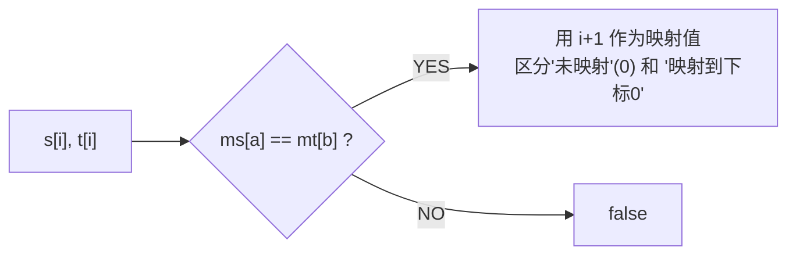

# 同构字符串 / 单词规律

> LeetCode 205/290 · ⭐ · 双射映射

## 054 同构字符串 (205)

### 01. 题目

`s="egg", t="add"` → true。字符到字符的双射映射。

### 02. 分析

需要**正反两个映射**。单映射 `e→a, g→d` 不够——可能两个不同字符映射到同一个目标（如 `"ab"→"aa"`）。



### 代码

**Java**：
```java
public boolean isIsomorphic(String s, String t) {
    int[] ms = new int[256], mt = new int[256];
    for (int i = 0; i < s.length(); i++) {
        char a = s.charAt(i), b = t.charAt(i);
        if (ms[a] != mt[b]) return false;  // 双射冲突
        ms[a] = mt[b] = i + 1;              // 用 i+1 代替映射值
    }
    return true;
}
```

**Python**：
```python
def isIsomorphic(self, s, t):
    ms, mt = {}, {}
    for a, b in zip(s, t):
        if ms.get(a, b) != b or mt.get(b, a) != a: return False
        ms[a] = b; mt[b] = a
    return True
```

**复杂度**：O(N)/O(1)。

---

## 055 单词规律 (290)

### 题目

`pattern="abba", s="dog cat cat dog"` → true。D054 的单词版。

**Java**：
```java
public boolean wordPattern(String pattern, String s) {
    String[] words = s.split(" ");
    if (pattern.length() != words.length) return false;
    Map<Character, String> pm = new HashMap<>();
    Map<String, Character> wm = new HashMap<>();
    for (int i = 0; i < pattern.length(); i++) {
        char c = pattern.charAt(i);
        if (pm.containsKey(c) && !pm.get(c).equals(words[i])) return false;
        if (wm.containsKey(words[i]) && wm.get(words[i]) != c) return false;
        pm.put(c, words[i]); wm.put(words[i], c);
    }
    return true;
}
```

**Python**：
```python
def wordPattern(self, p, s):
    words = s.split()
    if len(p) != len(words): return False
    return len(set(zip(p, words))) == len(set(p)) == len(set(words))
```

### 双射思想总结

| 场景 | 映射关系 | 验证条件 |
|------|---------|---------|
| 同构字符串 | char → char | 正反查表一致 |
| 单词规律 | char → word | 正反查表一致 |
