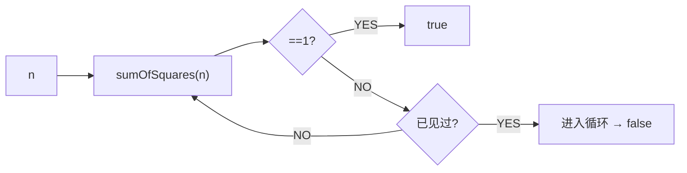

# 快乐数（Happy Number）

> LeetCode 202 · ⭐ · 哈希判环

## 01. 题目

不断替换为各位数字平方和。最终变为 1→快乐数，进入循环→非快乐数。`19` → true。

```
1²+9²=82 → 8²+2²=68 → 6²+8²=100 → 1²+0²+0²=1 ✓
```

## 02. 题目分析

### 本质：链表判环

将每次计算看作"链表的下一个节点"。快乐数最终到达 1（无环），非快乐数进入循环（有环）。



### 也可以快慢指针

同 B004 环形链表——快指针两步慢指针一步判环。

## 03. 代码

**Java**（HashSet）：
```java
public boolean isHappy(int n) {
    Set<Integer> seen = new HashSet<>();
    while (n != 1 && !seen.contains(n)) { seen.add(n); n = sumSq(n); }
    return n == 1;
}
int sumSq(int n) { int s = 0; while (n > 0) { int d = n % 10; s += d * d; n /= 10; } return s; }
```

**Java**（快慢指针 O(1)空间）：
```java
public boolean isHappy(int n) {
    int slow = n, fast = n;
    do { slow = sumSq(slow); fast = sumSq(sumSq(fast)); } while (slow != fast);
    return slow == 1;
}
```

**Python**：
```python
def isHappy(self, n):
    seen = set()
    while n != 1 and n not in seen: seen.add(n); n = sum(int(d)**2 for d in str(n))
    return n == 1
```

**复杂度**：O(logN)/O(logN)。

**相关题目**：[B004 环形链表](../08.链表算法题/004-B-环形链表.md)
