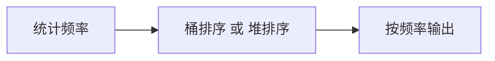

# 根据字符出现频率排序（Sort Characters By Frequency）

> LeetCode 451 · ⭐⭐ · 哈希+桶排序

## 01. 题目

`s = "tree"` → `"eert"`。按字符频率降序排列。

## 02. 题目分析



桶排序 O(N)：频次范围不超过 N，用索引当频率。

## 03. 代码

**Java**（桶排序 O(N)）：
```java
public String frequencySort(String s) {
    Map<Character, Integer> freq = new HashMap<>();
    for (char c : s.toCharArray()) freq.merge(c, 1, Integer::sum);
    List<Character>[] buckets = new List[s.length() + 1];
    for (char c : freq.keySet()) {
        int f = freq.get(c);
        if (buckets[f] == null) buckets[f] = new ArrayList<>();
        buckets[f].add(c);
    }
    StringBuilder sb = new StringBuilder();
    for (int i = buckets.length - 1; i >= 0; i--)
        if (buckets[i] != null)
            for (char c : buckets[i])
                for (int j = 0; j < i; j++) sb.append(c);
    return sb.toString();
}
```

**Python**（Counter + most_common）：
```python
def frequencySort(self, s: str) -> str:
    from collections import Counter
    return ''.join(c * f for c, f in Counter(s).most_common())
```

**C++**：
```cpp
string frequencySort(string s) {
    unordered_map<char,int> f; for(char c:s) f[c]++;
    map<int,vector<char>,greater<int>> buckets;
    for(auto& [c,v]:f) buckets[v].push_back(c);
    string ans; for(auto& [k,v]:buckets) for(char c:v) ans.append(k,c);
    return ans;
}
```

**复杂度**：桶排序 O(N)，堆排序 O(NlogK)。

## 04. 总结

| 核心 | 说明 |
|------|------|
| 桶排序 | 频次 ≤ N → 用数组索引当频率 |
| 堆 | PriorityQueue 维护 TopK 频率 |
| 频率统计 | HashMap 存 char→freq |

**相关题目**：[051 字母异位词](051.字母异位词分组.md)、[F004 高频单词](../12.堆算法题/F004-前K个高频单词.md)
