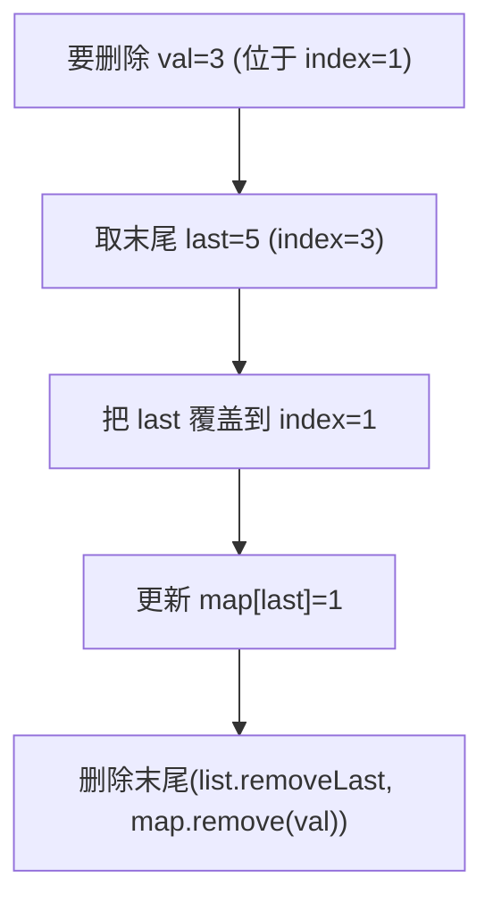

# O(1) 时间插入、删除和获取随机元素（RandomizedSet）

> LeetCode 380 · ⭐⭐ · 哈希+动态数组
>
> "组合数据结构"的经典范例——HashMap 负责 O(1) 查找，ArrayList 负责 O(1) 随机访问。删除时用"末位覆盖"技巧是神来之笔。

---

## 01. 题目描述

设计支持 O(1) 平均时间的 `insert/remove/getRandom` 的数据结构。

**示例**：

```
RandomizedSet set = new RandomizedSet();
set.insert(1);   // true
set.remove(2);   // false (不存在)
set.insert(2);   // true
set.getRandom(); // 1 或 2 (等概率)
set.remove(1);   // true
set.insert(2);   // false (已存在)
set.getRandom(); // 2
```

---

## 02. 题目分析

### 2.1 为什么单个结构不够？

| 操作 | ArrayList | HashMap | 组合 |
|------|:---:|:---:|:---:|
| insert | O(1)* | O(1) | O(1) |
| remove | **O(N)** | O(1) | **O(1)** |
| getRandom | O(1) | **不可能** | **O(1)** |

- ArrayList: remove 要移动元素 → O(N)
- HashMap: 无法 O(1) 等概率随机取键
- **组合**：HashMap 存 `val→index`（索引到 ArrayList），ArrayList 存值

### 2.2 remove 的末位覆盖技巧



```
删除前：list=[2, 3, 7, 5], map={2:0, 3:1, 7:2, 5:3}
删除 3:
  ① last=list[3]=5, 放到位置1: list=[2, 5, 7, 5]
  ② map[5]=1
  ③ 删末尾: list=[2, 5, 7], map 移除 3

结果：list=[2,5,7], map={2:0,5:1,7:2}
```

---

## 03. 代码

**Java**：
```java
class RandomizedSet {
    List<Integer> list = new ArrayList<>();
    Map<Integer, Integer> map = new HashMap<>();
    Random rand = new Random();

    public boolean insert(int val) {
        if (map.containsKey(val)) return false;
        map.put(val, list.size());
        list.add(val);
        return true;
    }

    public boolean remove(int val) {
        if (!map.containsKey(val)) return false;
        int idx = map.get(val), last = list.get(list.size() - 1);
        list.set(idx, last);                 // 末位覆盖
        map.put(last, idx);                  // 更新映射
        list.remove(list.size() - 1);        // 删末尾 O(1)
        map.remove(val);
        return true;
    }

    public int getRandom() { return list.get(rand.nextInt(list.size())); }
}
```

**Python**：
```python
class RandomizedSet:
    def __init__(self):
        self.lst, self.mp = [], {}

    def insert(self, val):
        if val in self.mp: return False
        self.mp[val] = len(self.lst)
        self.lst.append(val)
        return True

    def remove(self, val):
        if val not in self.mp: return False
        idx, last = self.mp[val], self.lst[-1]
        self.lst[idx] = last; self.mp[last] = idx  # 末位覆盖
        self.lst.pop(); del self.mp[val]
        return True

    def getRandom(self): return random.choice(self.lst)
```

**C++**：
```cpp
class RandomizedSet {
    vector<int> v; unordered_map<int,int> mp;
public:
    bool insert(int val) { if(mp.count(val)) return false; mp[val]=v.size(); v.push_back(val); return true; }
    bool remove(int val) { if(!mp.count(val)) return false; int idx=mp[val],last=v.back(); v[idx]=last; mp[last]=idx; v.pop_back(); mp.erase(val); return true; }
    int getRandom() { return v[rand()%v.size()]; }
};
```

**复杂度**：全部 O(1)。

---

## 04. 总结

| 核心启示 | 说明 |
|---------|------|
| 组合思想 | HashMap 补 ArrayList 的 remove 慢，ArrayList 补 HashMap 的随机访问 |
| 末位覆盖 | 删除时用末位元素覆盖被删位置，O(1) 完成 |
| 等概率 | ArrayList O(1) 随机下标 → 等概率随机取值 |

**相关题目**：[B015 LRU 缓存](../08.链表算法题/015-B-LRU缓存.md)
