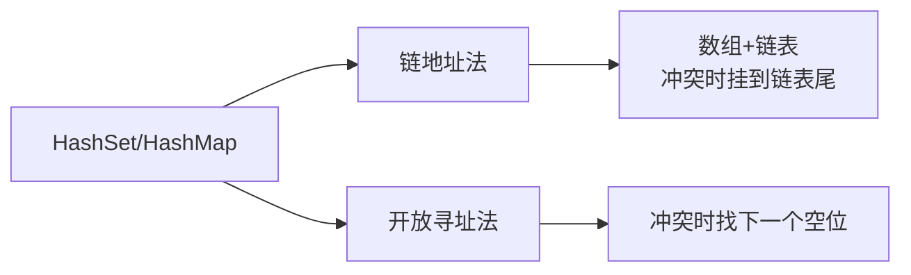

# 设计哈希集合 / 设计哈希映射

> LeetCode 705/706 · ⭐ · 链地址法

## 01. 题目

实现 HashSet 和 HashMap（add/remove/contains 和 put/get/remove）。

## 02. 题目分析

### 哈希冲突解决



链地址法：取 `key % CAP` 定位桶，冲突时遍历链表。

### 为什么 HashMap 更难？

HashSet 只需存 key。HashMap 需要存 (key, value) 对，且 put 时要判断是新增还是更新。

## 03. HashSet 代码

**Java**：
```java
class MyHashSet {
    static final int CAP = 10000;
    Node[] buckets = new Node[CAP];
    static class Node { int key; Node next; Node(int k) { key = k; } }

    int hash(int key) { return key % CAP; }

    public void add(int key) {
        int idx = hash(key);
        if (buckets[idx] == null) { buckets[idx] = new Node(key); return; }
        Node cur = buckets[idx], prev = null;
        while (cur != null) { if (cur.key == key) return; prev = cur; cur = cur.next; }
        prev.next = new Node(key);
    }

    public void remove(int key) {
        int idx = hash(key); Node cur = buckets[idx], prev = null;
        while (cur != null) {
            if (cur.key == key) {
                if (prev == null) buckets[idx] = cur.next;
                else prev.next = cur.next;
                return;
            }
            prev = cur; cur = cur.next;
        }
    }

    public boolean contains(int key) {
        Node cur = buckets[hash(key)];
        while (cur != null) { if (cur.key == key) return true; cur = cur.next; }
        return false;
    }
}
```

## 04. HashMap 代码

```java
class MyHashMap {
    static class Node { int k, v; Node next; Node(int k, int v) { this.k=k; this.v=v; } }
    Node[] buckets = new Node[10000];
    int hash(int k) { return k % buckets.length; }

    public void put(int k, int v) {
        int i = hash(k); Node cur = buckets[i];
        if (cur == null) { buckets[i] = new Node(k, v); return; }
        Node prev = null;
        while (cur != null) { if (cur.k == k) { cur.v = v; return; } prev=cur; cur=cur.next; }
        prev.next = new Node(k, v);
    }

    public int get(int k) {
        Node cur = buckets[hash(k)];
        while (cur != null) { if (cur.k == k) return cur.v; cur = cur.next; }
        return -1;
    }

    public void remove(int k) {
        int i = hash(k); Node cur = buckets[i], prev = null;
        while (cur != null) {
            if (cur.k == k) {
                if (prev == null) buckets[i] = cur.next; else prev.next = cur.next;
                return;
            }
            prev = cur; cur = cur.next;
        }
    }
}
```

**Python**：
```python
class MyHashSet:
    def __init__(self): self.b = [[] for _ in range(1000)]
    def add(self, k):
        i = k % len(self.b)
        if k not in self.b[i]: self.b[i].append(k)
    def remove(self, k):
        i = k % len(self.b)
        self.b[i] = [x for x in self.b[i] if x != k]
    def contains(self, k): return k in self.b[k % len(self.b)]
```

## 05. 哈希冲突深入

| 解决方式 | 优点 | 缺点 | Java |
|------|------|------|------|
| 链地址法 | 简单 | 链表过长退化为 O(N) | HashMap(红黑树退化) |
| 开放寻址 | 缓存友好 | 删除麻烦 | ThreadLocalMap |

**复杂度**：平均 O(1)，最坏 O(N)（全冲突）。

**相关题目**：[059 随机集合](059.O1时间插入删除获取随机元素.md)
