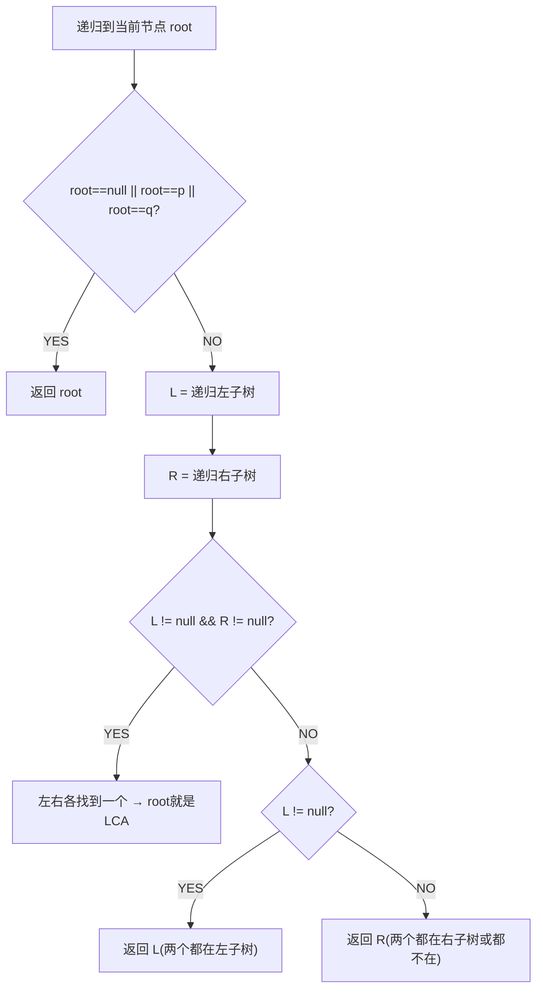

# 二叉树的最近公共祖先（LCA）

> LeetCode 236 · ⭐⭐ · 后序遍历

---

## 01. 题目描述

找出二叉树中两个节点 `p` 和 `q` 的最近公共祖先。

```
       3
     /   \
    5     1
   / \   / \
  6   2 0   8
     / \
    7   4

p=5, q=1 → LCA=3
p=5, q=4 → LCA=5
```

---

## 02. 题目分析

### 2.1 核心思路



### 2.2 三种情况

| 情况 | 判断条件 | 返回值 | 示例 |
|------|---------|--------|------|
| 分布在左右 | `L!=null && R!=null` | root | p=5,q=1 → 3 |
| 都在左 | `L!=null` | L | p=5,q=4 → 5 |
| 都在右 | `R!=null` | R | — |

---

## 03. 代码

**Java**：
```java
public TreeNode lowestCommonAncestor(TreeNode root, TreeNode p, TreeNode q) {
    if (root == null || root == p || root == q) return root;
    TreeNode left = lowestCommonAncestor(root.left, p, q);
    TreeNode right = lowestCommonAncestor(root.right, p, q);
    if (left != null && right != null) return root;     // 分布在左右
    return left != null ? left : right;                  // 都在一侧
}
```

**Python**：
```python
def lowestCommonAncestor(self, root, p, q):
    if not root or root == p or root == q: return root
    left = self.lowestCommonAncestor(root.left, p, q)
    right = self.lowestCommonAncestor(root.right, p, q)
    if left and right: return root
    return left or right
```

**C++**：
```cpp
TreeNode* lowestCommonAncestor(TreeNode* root, TreeNode* p, TreeNode* q) {
    if (!root || root == p || root == q) return root;
    auto left = lowestCommonAncestor(root->left, p, q);
    auto right = lowestCommonAncestor(root->right, p, q);
    if (left && right) return root;
    return left ? left : right;
}
```

**复杂度**：O(N)/O(H)。

---

## 04. BST 版本 LCA

若为 BST，可利用有序性质 O(logN)：

```java
public TreeNode lowestCommonAncestor(TreeNode root, TreeNode p, TreeNode q) {
    if (root.val > p.val && root.val > q.val) return lowestCommonAncestor(root.left, p, q);
    if (root.val < p.val && root.val < q.val) return lowestCommonAncestor(root.right, p, q);
    return root; // 一个在左一个在右
}
```

**相关**：[084 最大路径和](084.二叉树中的最大路径和.md)
