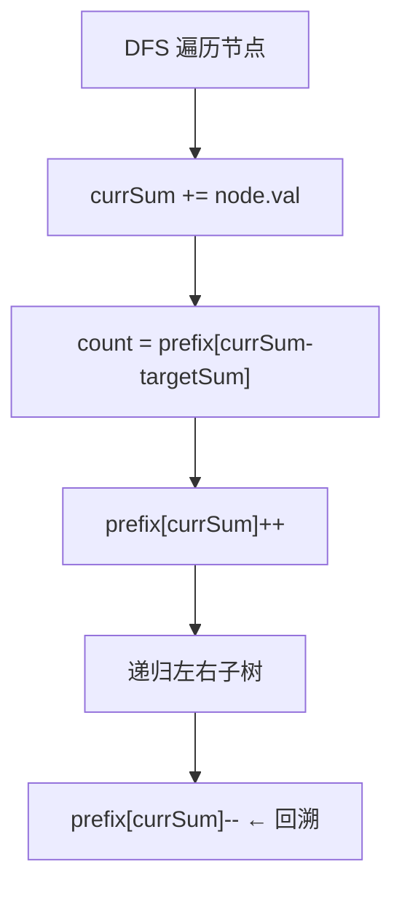

# 路径总和 III（Path Sum III）

> LeetCode 437 · ⭐⭐ · 前缀和+DFS回溯

---

## 01. 题目描述

统计二叉树中路径和等于 `targetSum` 的路径数。路径必须向下，不需要从根开始或到叶子结束。

**示例**：

```
root = [10,5,-3,3,2,null,11,3,-2,null,1], targetSum = 8
输出：3

路径1: 5→3
路径2: 5→2→1  
路径3: -3→11
```

---

## 02. 题目分析

### 2.1 朴素思路：两次DFS O(N²)

对每个节点作为起点，DFS 向下统计路径。O(N²)，大数据超时。

### 2.2 前缀和+回溯 O(N)



**核心公式**：同 A014 前缀和 `sum(i,j)=pre[j]-pre[i-1]=K`。

### 2.3 手推

```
        10
       /  \
      5   -3
     / \    \
    3   2   11
   /    \
  3     -2
 /
1    targetSum = 8

currSum=10: prefix[10-8=2]=0 → 0条
currSum=15: prefix[15-8=7]=0 → 0条
currSum=18: prefix[18-8=10]=1 → 1条 (3→10... 即 5→3)
...
```

---

## 03. 代码

**Java**：
```java
public int pathSum(TreeNode root, int targetSum) {
    Map<Long, Integer> prefix = new HashMap<>();
    prefix.put(0L, 1);                                // 空前缀
    return dfs(root, 0L, targetSum, prefix);
}
int dfs(TreeNode node, long sum, int target, Map<Long, Integer> prefix) {
    if (node == null) return 0;
    sum += node.val;
    int count = prefix.getOrDefault(sum - target, 0); // 以当前节点结尾的有效路径数
    prefix.merge(sum, 1, Integer::sum);               // 加入当前前缀
    count += dfs(node.left, sum, target, prefix);
    count += dfs(node.right, sum, target, prefix);
    prefix.merge(sum, -1, Integer::sum);              // 回溯
    return count;
}
```

**Python**：
```python
def pathSum(self, root, targetSum):
    prefix = {0: 1}
    def dfs(node, s):
        if not node: return 0
        s += node.val
        cnt = prefix.get(s - targetSum, 0)
        prefix[s] = prefix.get(s, 0) + 1
        cnt += dfs(node.left, s) + dfs(node.right, s)
        prefix[s] -= 1
        return cnt
    return dfs(root, 0)
```

**C++**：
```cpp
int pathSum(TreeNode* root, int target) {
    unordered_map<long, int> prefix{{0, 1}};
    function<int(TreeNode*,long)> dfs = [&](TreeNode* n, long s) {
        if (!n) return 0; s += n->val;
        int cnt = prefix[s - target];
        prefix[s]++; cnt += dfs(n->left, s) + dfs(n->right, s);
        prefix[s]--; return cnt;
    };
    return dfs(root, 0);
}
```

**复杂度**：O(N)/O(N)。

---

## 04. 总结

| 核心 | 说明 |
|------|------|
| 前缀和公式 | `prefix[currSum-K]` = 以当前结尾的有效路径数 |
| 回溯 | 返回父节点时移除当前前缀 |
| 初始化 `{0:1}` | 处理从根开始的路径 |

**相关**：[A014 和为K的子数组](../07.数组算法题/014-A-和为K的子数组.md)
