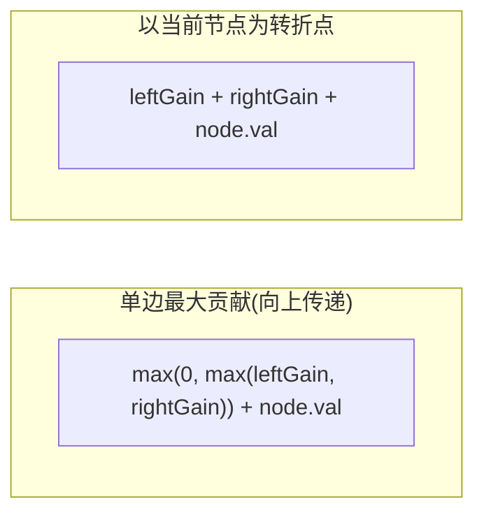

# 二叉树中的最大路径和（Binary Tree Maximum Path Sum）

> LeetCode 124 · ⭐⭐⭐ · 后序+贡献值

---

## 01. 题目描述

路径 = 任意起点到任意终点的节点序列（每个节点最多一次）。求最大路径和。

**示例 1**：

```
输入：root = [1,2,3]

    1
   / \
  2   3

输出：6  (2→1→3)
```

**示例 2**：

```
输入：root = [-10,9,20,null,null,15,7]

  -10
  /  \
 9   20
    /  \
   15   7

输出：42  (15→20→7)
```

---

## 02. 题目分析

### 2.1 核心概念：单边贡献 vs 全局最大



对每个节点，我们计算两个值：

| 值 | 含义 | 去向 |
|------|------|------|
| `单边贡献` | 以当前节点为一端向下的最大路径和 | 返回给父节点 |
| `全局最大` | 以当前节点为转折点的路径和 | 更新全局答案 |

### 2.2 为什么负数贡献取 0？

如果子树贡献为负，那就不选它——`max(0, leftGain)` 相当于"切断该分支"。

### 2.3 手推演示

```
       -10
       /  \
      9   20
          /  \
         15   7

叶节点 9:   gain=9, maxPath=9
叶节点 15:  gain=15, maxPath=15
叶节点 7:   gain=7, maxPath=7

节点 20:
  leftGain=15, rightGain=7
  gain = max(0,max(15,7))+20 = 35     ← 返回给-10
  maxPath = max(7, 15+7+20) = 42      ← 全局答案！

节点 -10:
  leftGain=9, rightGain=35
  gain = max(0,max(9,35))+(-10) = 25
  maxPath = max(42, 9+35+(-10)) = 42

最终：42
```

---

## 03. 代码

**Java**：
```java
int ans = Integer.MIN_VALUE;
public int maxPathSum(TreeNode root) { gain(root); return ans; }

int gain(TreeNode node) {
    if (node == null) return 0;
    int L = Math.max(0, gain(node.left));   // 负数舍弃
    int R = Math.max(0, gain(node.right));
    ans = Math.max(ans, L + R + node.val);  // 更新全局最大
    return Math.max(L, R) + node.val;        // 单边贡献
}
```

**Python**：
```python
def maxPathSum(self, root: TreeNode) -> int:
    self.ans = float('-inf')
    def gain(node):
        if not node: return 0
        L = max(0, gain(node.left))
        R = max(0, gain(node.right))
        self.ans = max(self.ans, L + R + node.val)
        return max(L, R) + node.val
    gain(root)
    return self.ans
```

**C++**：
```cpp
int ans = INT_MIN;
int maxPathSum(TreeNode* root) { gain(root); return ans; }
int gain(TreeNode* node) {
    if (!node) return 0;
    int L = max(0, gain(node->left)), R = max(0, gain(node->right));
    ans = max(ans, L + R + node->val);
    return max(L, R) + node->val;
}
```

**复杂度**：O(N)/O(H)。

---

## 04. 与 LCA 的对比

| | LCA | 最大路径和 |
|------|------|------|
| 遍历方式 | 后序 | 后序 |
| 向上传递 | 找到的节点 | 单边最大贡献 |
| 全局判断 | L&&R → root | `ans=max(ans, L+R+val)` |
| 复杂度 | O(N) | O(N) |

---

## 05. 总结

| 核心启示 | 说明 |
|---------|------|
| 贡献值 | `max(0, max(L,R)) + val` = 单边向上传递 |
| 转折点 | `L + R + val` = 以当前为转折的完整路径 |
| 负数舍弃 | `max(0, gain)` 切断负贡献分支 |

**相关**：[074 二叉树的直径](074.二叉树的直径.md)、[075 最近公共祖先](075.二叉树的最近公共祖先.md)
