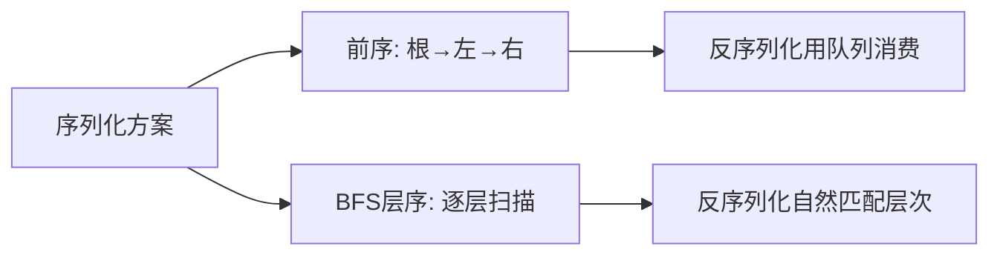

# 序列化与反序列化二叉树（Serialize and Deserialize）

> LeetCode 297 · ⭐⭐⭐ · BFS 层序序列化

---

## 01. 题目描述

设计算法将二叉树序列化为字符串，再反序列化还原二叉树。

**示例**：

```
    1
   / \
  2   3
     / \
    4   5

序列化 → "1,2,3,null,null,4,5,null,null,null,null"
```

---

## 02. 题目分析

### 2.1 为什么用 BFS？



**BFS 优势**：序列化和反序列化都自然是"从左到右逐层"的，不需要额外标记。

### 2.2 空节点必须记录

不记录 `null` 无法区分 `[1,null,2]` 和 `[1,2]`。

### 2.3 序列化流程

```
BFS 遍历每个节点：
  - node != null → 记录 val，左右子节点入队
  - node == null → 记录 "null"
```

### 2.4 反序列化流程

```
vals = split(data)
root = new TreeNode(vals[0])
队列初始化 = [root]
i = 1
while 队列非空：
  弹出 node
  vals[i] != "null" → node.left = new TreeNode, 入队
  i++
  vals[i] != "null" → node.right = new TreeNode, 入队
  i++
```

---

## 03. 代码

**Java**：
```java
public String serialize(TreeNode root) {
    if (root == null) return "null";
    StringBuilder sb = new StringBuilder();
    Queue<TreeNode> q = new LinkedList<>(); q.offer(root);
    while (!q.isEmpty()) {
        TreeNode n = q.poll();
        if (n == null) sb.append("null,");
        else { sb.append(n.val).append(","); q.offer(n.left); q.offer(n.right); }
    }
    return sb.toString();
}

public TreeNode deserialize(String data) {
    if ("null".equals(data)) return null;
    String[] vals = data.split(",");
    TreeNode root = new TreeNode(Integer.parseInt(vals[0]));
    Queue<TreeNode> q = new LinkedList<>(); q.offer(root);
    for (int i = 1; i < vals.length; i += 2) {
        TreeNode node = q.poll();
        if (!"null".equals(vals[i])) {
            node.left = new TreeNode(Integer.parseInt(vals[i])); q.offer(node.left);
        }
        if (i + 1 < vals.length && !"null".equals(vals[i + 1])) {
            node.right = new TreeNode(Integer.parseInt(vals[i + 1])); q.offer(node.right);
        }
    }
    return root;
}
```

**Python**：
```python
class Codec:
    def serialize(self, root):
        if not root: return "null"
        res, q = [], deque([root])
        while q:
            node = q.popleft()
            if not node: res.append("null")
            else: res.append(str(node.val)); q.append(node.left); q.append(node.right)
        return ",".join(res)

    def deserialize(self, data):
        if data == "null": return None
        vals = data.split(",")
        root = TreeNode(int(vals[0]))
        q = deque([root])
        i = 1
        while q and i < len(vals):
            node = q.popleft()
            if vals[i] != "null": node.left = TreeNode(int(vals[i])); q.append(node.left)
            i += 1
            if i < len(vals) and vals[i] != "null": node.right = TreeNode(int(vals[i])); q.append(node.right)
            i += 1
        return root
```

**C++**：
```cpp
string serialize(TreeNode* root) {
    if (!root) return "null";
    string res; queue<TreeNode*> q; q.push(root);
    while (!q.empty()) {
        auto n = q.front(); q.pop();
        if (!n) res += "null,";
        else { res += to_string(n->val) + ","; q.push(n->left); q.push(n->right); }
    }
    return res;
}
TreeNode* deserialize(string data) {
    if (data == "null") return nullptr;
    vector<string> vals; stringstream ss(data); string s;
    while (getline(ss, s, ',')) vals.push_back(s);
    auto root = new TreeNode(stoi(vals[0]));
    queue<TreeNode*> q; q.push(root);
    for (int i = 1; i < vals.size(); i += 2) {
        auto node = q.front(); q.pop();
        if (vals[i] != "null") { node->left = new TreeNode(stoi(vals[i])); q.push(node->left); }
        if (i+1 < vals.size() && vals[i+1] != "null") { node->right = new TreeNode(stoi(vals[i+1])); q.push(node->right); }
    }
    return root;
}
```

**复杂度**：O(N)/O(N)。

---

## 04. 总结

| 要点 | 说明 |
|------|------|
| 空节点必须存 | `null` 保留结构信息 |
| BFS 自然 | 序列化=层序遍历，反序列化=逐层建树 |
| 队列同步 | 序列化和反序列化共享同一队列逻辑 |

**相关**：[069 层序遍历](069.二叉树的层序遍历.md)
