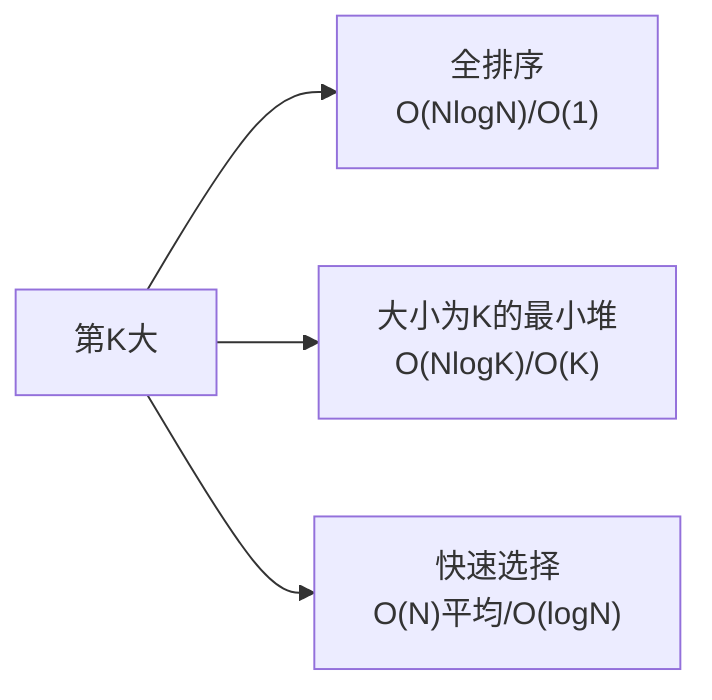

# 数组中的第 K 个最大元素（Kth Largest Element）

> LeetCode 215 · ⭐⭐ · 快速选择 / 堆
>
> 一道题考察了排序、堆、快速选择三种思路。面试首选快速选择（O(N) 平均），次选大小为 K 的最小堆（O(NlogK)）。

---

## 01. 题目描述

**示例 1**：
```
输入：nums = [3,2,1,5,6,4], k = 2
输出：5
```

**示例 2**：
```
输入：nums = [3,2,3,1,2,4,5,5,6], k = 4
输出：4
```

---

## 02. 题目分析：三种思维的演变



| 解法 | 时间 | 空间 | 核心思想 |
|------|:---:|:---:|------|
| 全排序 | O(NlogN) | O(1) | 直接取第K个 |
| 最小堆 | O(NlogK) | O(K) | 维护K个"候选最大值" |
| **快速选择** | **O(N)平均** | O(logN) | 快排partition，只递归一侧 |

### 2.1 最小堆为什么是大小为K的**最小**堆？

堆顶是堆中最小值。当堆大小>K时，弹出最小值——**淘汰最小的，保留K个最大的**。最终堆顶就是第K大。

```
nums = [3,2,1,5,6,4], k=2

3入堆: pq=[3]
2入堆: pq=[2,3]  堆顶=2(第2大)  size=2, 不需要弹出
1入堆: pq=[1,2,3] → poll去掉1 → pq=[2,3]  堆顶=2
5入堆: pq=[2,3,5] → poll去掉2 → pq=[3,5]  堆顶=3
6入堆: pq=[3,5,6] → poll去掉3 → pq=[5,6]  堆顶=5
4入堆: pq=[4,5,6] → poll去掉4 → pq=[5,6]  堆顶=5 ←答案
```

### 2.2 快速选择的直觉

快排的 partition 把数组分成 `[小于pivot] | pivot | [大于pivot]`。pivot 的 index 如果 == N-K，它就是答案。否则只递归一侧。

---

## 03. 解法一：最小堆（O(NlogK)）

```java
public int findKthLargest(int[] nums, int k) {
    PriorityQueue<Integer> pq = new PriorityQueue<>(); // 默认最小堆
    for (int n : nums) {
        pq.offer(n);
        if (pq.size() > k) pq.poll();   // 淘汰最小的
    }
    return pq.peek();
}
```

**Python**：
```python
def findKthLargest(self, nums: List[int], k: int) -> int:
    import heapq
    pq = []
    for n in nums:
        heapq.heappush(pq, n)
        if len(pq) > k: heapq.heappop(pq)
    return pq[0]
```

**C++**：
```cpp
int findKthLargest(vector<int>& nums, int k) {
    priority_queue<int, vector<int>, greater<int>> pq;
    for (int n : nums) { pq.push(n); if (pq.size() > k) pq.pop(); }
    return pq.top();
}
```

**复杂度**：O(NlogK) / O(K)。

---

## 04. 解法二：快速选择（O(N) 平均）

```java
public int findKthLargest(int[] nums, int k) {
    return quickSelect(nums, 0, nums.length - 1, nums.length - k);
}
int quickSelect(int[] a, int l, int r, int k) {
    int pivot = a[r], i = l;
    for (int j = l; j < r; j++)
        if (a[j] <= pivot) swap(a, i++, j);
    swap(a, i, r);
    if (i == k) return a[i];
    return i < k ? quickSelect(a, i + 1, r, k) : quickSelect(a, l, i - 1, k);
}
void swap(int[] a, int i, int j) { int t = a[i]; a[i] = a[j]; a[j] = t; }
```

**Python**：
```python
def findKthLargest(self, nums, k):
    def quick(l, r, k):
        pivot, i = nums[r], l
        for j in range(l, r):
            if nums[j] <= pivot: nums[i], nums[j] = nums[j], nums[i]; i += 1
        nums[i], nums[r] = nums[r], nums[i]
        if i == k: return nums[i]
        return quick(i+1, r, k) if i < k else quick(l, i-1, k)
    return quick(0, len(nums)-1, len(nums)-k)
```

**复杂度**：O(N)平均 / O(N²)最坏（有序时退化），O(logN)栈空间。

### 常见追问：如何避免 O(N²) 最坏？

随机化 pivot：`swap(a[r], a[rand.nextInt(r-l+1)+l])`。

---

## 05. 两解法对比

| 维度 | 最小堆 | 快速选择 |
|------|:---:|:---:|
| 时间复杂度 | O(NlogK) | **O(N) 平均** |
| 空间复杂度 | O(K) | O(logN) |
| 稳定性 | 很稳定 | 最坏 O(N²) |
| K << N 时 | 优 | — |
| K ≈ N 时 | O(NlogN) | O(N) |
| 面试推荐 | ✅ 首选 | ✅** 加分 |

---

## 06. 总结

| 核心启示 | 说明 |
|---------|------|
| 最小堆维护TopK | 大小为K的最小堆，堆顶=第K大 |
| 快速选择 | partition后只递归一侧，O(N)平均 |
| 与中位数的联系 | 找中位数 = 第 N/2 大 = KthLargest 的特例 |

**相关题目**：[087 数据流中位数](087.数据流的中位数.md)、[J001 快速排序](../16.排序算法题/J001-快速排序.md)
