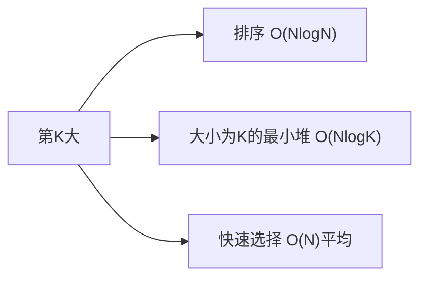

# 数组中的第 K 个最大元素（Kth Largest）

> LeetCode 215 · ⭐⭐ · 快速选择 / 堆

## 01. 题目

`[3,2,1,5,6,4], k=2` → 5（第2大=5）

## 02. 题目分析

### 三解法对比



| 解法 | 时间 | 空间 | 面试 |
|------|:---:|:---:|:---:|
| 排序 | O(NlogN) | O(1) | ❌ |
| 最小堆 | O(NlogK) | O(K) | ✅ |
| **快速选择** | **O(N)平均** | O(logN) | ✅** |

## 03. 快速选择（Quick Select）

```java
public int findKthLargest(int[] nums, int k) {
    return quickSelect(nums, 0, nums.length - 1, nums.length - k);
}
int quickSelect(int[] a, int l, int r, int k) {
    int pivot = a[r], i = l;
    for (int j = l; j < r; j++) if (a[j] <= pivot) swap(a, i++, j);
    swap(a, i, r);
    if (i == k) return a[i];
    return i < k ? quickSelect(a, i + 1, r, k) : quickSelect(a, l, i - 1, k);
}
void swap(int[] a, int i, int j) { int t = a[i]; a[i] = a[j]; a[j] = t; }
```

## 04. 堆解法

```java
public int findKthLargest(int[] nums, int k) {
    PriorityQueue<Integer> pq = new PriorityQueue<>(); // 最小堆
    for (int n : nums) { pq.offer(n); if (pq.size() > k) pq.poll(); }
    return pq.peek();
}
```

**Python**：
```python
def findKthLargest(self, nums, k):
    import heapq
    return heapq.nlargest(k, nums)[-1]
```

**复杂度**：快选 O(N)平均/O(N²)最坏，堆 O(NlogK)。

**相关**：[087 数据流中位数](087.数据流的中位数.md)
