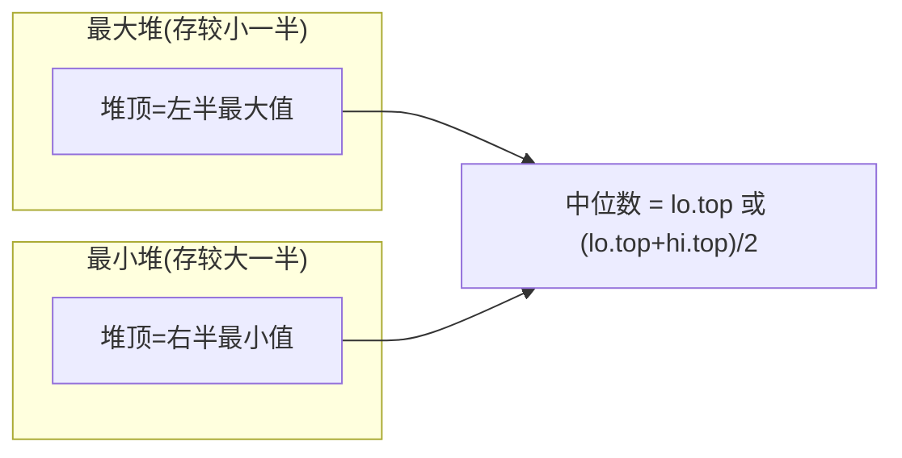
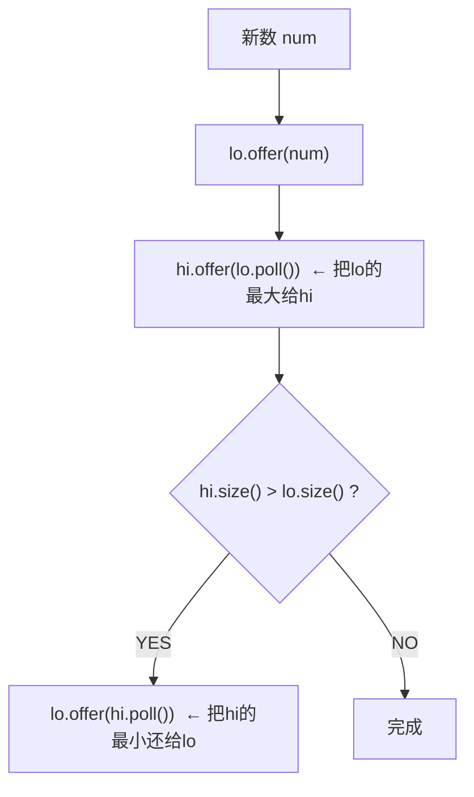

# 数据流的中位数（Find Median from Data Stream）

> LeetCode 295 · ⭐⭐⭐ · 双堆
>
> 第K大是"静态TopK"，中位数是"动态TopK"——数据不断流入，随时能返回中位数。双堆是最优雅的解法。

---

## 01. 题目描述

实现 `MedianFinder` 类：
- `addNum(int num)`：将整数添加到数据流中
- `findMedian()`：返回当前所有元素的中位数

**示例**：
```
addNum(1) → [1]       中位数=1
addNum(2) → [1,2]     中位数=1.5
findMedian() → 1.5
addNum(3) → [1,2,3]   中位数=2
findMedian() → 2
```

---

## 02. 题目分析

### 2.1 暴力解法

每次插入后排序 → O(NlogN)。数据流场景不可接受。

### 2.2 双堆设计



**平衡规则**：`lo.size() >= hi.size()`，|size差| ≤ 1。

### 2.3 插入流程



### 2.4 手推演示

```
addNum(5): lo=[5],hi=[] → hi.size()<lo.size() → 中位数=5
addNum(2): lo.offer(2)→lo=[2,5], hi.offer(lo.poll)=lo.poll=5? 不对...

重新来：
addNum(5): lo=[5], hi=[]
  → lo.offer(5): lo=[5]
  → hi.offer(lo.poll()): hi=[5], lo=[]
  → hi.size()>lo.size() → lo.offer(hi.poll()): lo=[5], hi=[]
  → 中位数=5

addNum(2): 
  → lo.offer(2): lo=[2,5]  (lo是最大堆: maxheap)
  → hi.offer(lo.poll()): lo.poll=5, hi=[5], lo=[2]
  → hi.size()==lo.size()==1 → 中位数=(2+5)/2=3.5

addNum(3):
  → lo.offer(3): lo=[3,2]  
  → hi.offer(lo.poll()=3): hi=[3,5], lo=[2]
  → hi.size()>lo.size() → lo.offer(hi.poll()=3): lo=[3,2], hi=[5]
  → 中位数=lo.top=3
```

---

## 03. 代码

**Java**：
```java
class MedianFinder {
    // lo: 存储较小一半 → 最大堆(取反或用Comparator)
    PriorityQueue<Integer> lo = new PriorityQueue<>(Collections.reverseOrder());
    // hi: 存储较大一半 → 最小堆(默认)
    PriorityQueue<Integer> hi = new PriorityQueue<>();

    public void addNum(int num) {
        lo.offer(num);
        hi.offer(lo.poll());          // 把lo的最大值给hi
        if (hi.size() > lo.size())    // 保持平衡
            lo.offer(hi.poll());
    }

    public double findMedian() {
        return lo.size() > hi.size() ?
            lo.peek() : (lo.peek() + hi.peek()) / 2.0;
    }
}
```

**Python**：
```python
class MedianFinder:
    def __init__(self):
        self.lo = []  # 最大堆（取反存储）
        self.hi = []  # 最小堆

    def addNum(self, num: int) -> None:
        heapq.heappush(self.lo, -num)
        heapq.heappush(self.hi, -heapq.heappop(self.lo))
        if len(self.hi) > len(self.lo):
            heapq.heappush(self.lo, -heapq.heappop(self.hi))

    def findMedian(self) -> float:
        if len(self.lo) > len(self.hi):
            return -self.lo[0]
        return (-self.lo[0] + self.hi[0]) / 2
```

**C++**：
```cpp
class MedianFinder {
    priority_queue<int> lo;                           // 最大堆
    priority_queue<int, vector<int>, greater<int>> hi; // 最小堆
public:
    void addNum(int num) {
        lo.push(num); hi.push(lo.top()); lo.pop();
        if (hi.size() > lo.size()) { lo.push(hi.top()); hi.pop(); }
    }
    double findMedian() {
        return lo.size() > hi.size() ? lo.top() : (lo.top() + hi.top()) / 2.0;
    }
};
```

**复杂度**：add O(logN)，find O(1)。

---

## 04. 总结

| 核心启示 | 说明 |
|---------|------|
| 双堆思想 | 一个最大堆 + 一个最小堆 = 中位数的天然存储结构 |
| 平衡规则 | 每次插入后做一次"lo→hi→lo"的三步循环 |
| TopK 延伸 | 静态(KthLargest) → 动态(数据流中位数) |

**相关题目**：[086 第K大](086.数组中的第K个最大元素.md)
