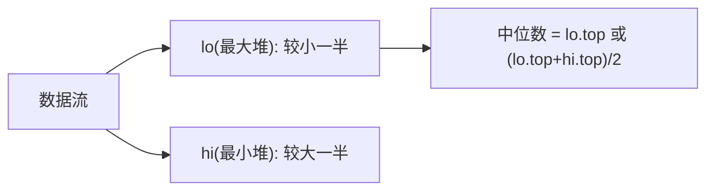

# 数据流的中位数（Find Median from Data Stream）

> LeetCode 295 · ⭐⭐⭐ · 双堆

## 01. 题目

设计支持 `addNum` 和 `findMedian` 的数据结构。

## 02. 分析



**平衡策略**：`lo.size() >= hi.size()`，差不超过1。

**入堆流程**：新数先入 lo → 弹出 lo 最大入 hi → 若 hi 更大则弹出 hi 最小回 lo。

## 03. 代码

**Java**：
```java
class MedianFinder {
    PriorityQueue<Integer> lo = new PriorityQueue<>(Collections.reverseOrder());
    PriorityQueue<Integer> hi = new PriorityQueue<>();

    public void addNum(int num) {
        lo.offer(num); hi.offer(lo.poll());
        if (hi.size() > lo.size()) lo.offer(hi.poll());
    }
    public double findMedian() {
        return lo.size() > hi.size() ? lo.peek() : (lo.peek() + hi.peek()) / 2.0;
    }
}
```

**Python**：
```python
class MedianFinder:
    def __init__(self): self.lo, self.hi = [], []  # lo取反为最大堆
    def addNum(self, num):
        heapq.heappush(self.lo, -num); heapq.heappush(self.hi, -heapq.heappop(self.lo))
        if len(self.hi) > len(self.lo): heapq.heappush(self.lo, -heapq.heappop(self.hi))
    def findMedian(self):
        return -self.lo[0] if len(self.lo) > len(self.hi) else (-self.lo[0] + self.hi[0]) / 2
```

**复杂度**：add O(logN)，find O(1)。

**相关**：[086 第K大](086.数组中的第K个最大元素.md)
