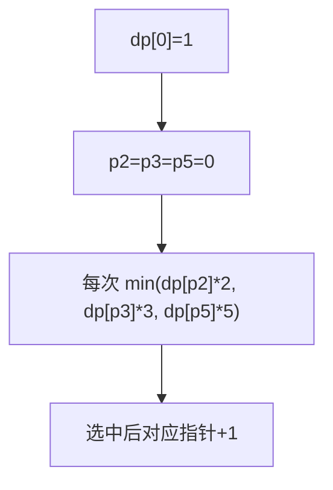

# 丑数 II（Ugly Number II）

> LeetCode 264 · ⭐⭐ · 多路归并（三指针）

---

## 01. 题目

只含质因数 2/3/5 的第 n 个丑数。`n=10` → 12（1,2,3,4,5,6,8,9,10,12）

---

## 02. 题目分析

### 2.1 朴素思路

从 1 开始逐个检查每个数是否为丑数 → 太慢。

### 2.2 三指针归并



**本质**：三个有序序列的归并。

| 序列 | 生成方式 | 前几个值 |
|------|---------|------|
| ×2 | dp[p2]×2 | 2,4,6,8,10,... |
| ×3 | dp[p3]×3 | 3,6,9,12,15,... |
| ×5 | dp[p5]×5 | 5,10,15,20,25,... |

### 2.3 手推

```
dp[0]=1, p2=p3=p5=0

i=1: n2=2, n3=3, n5=5 → min=2 → dp[1]=2, p2++
i=2: n2=4, n3=3, n5=5 → min=3 → dp[2]=3, p3++
i=3: n2=4, n3=6, n5=5 → min=4 → dp[3]=4, p2++
i=4: n2=6, n3=6, n5=5 → min=5 → dp[4]=5, p5++
i=5: n2=6, n3=6, n5=10→ min=6 → dp[5]=6, p2++ && p3++ (两个6)
```

**注意**：`dp[i]==n2` 时不加 else，让相等的指针同时前进（如6同时被p2和p3命中），防止重复。

---

## 03. 代码

**Java**：
```java
public int nthUglyNumber(int n) {
    int[] dp = new int[n]; dp[0] = 1;
    int p2 = 0, p3 = 0, p5 = 0;
    for (int i = 1; i < n; i++) {
        int n2 = dp[p2] * 2, n3 = dp[p3] * 3, n5 = dp[p5] * 5;
        dp[i] = Math.min(n2, Math.min(n3, n5));
        if (dp[i] == n2) p2++;
        if (dp[i] == n3) p3++;
        if (dp[i] == n5) p5++;
    }
    return dp[n - 1];
}
```

**Python**：
```python
def nthUglyNumber(self, n: int) -> int:
    dp = [1]; p2 = p3 = p5 = 0
    for _ in range(n - 1):
        n2, n3, n5 = dp[p2]*2, dp[p3]*3, dp[p5]*5
        nxt = min(n2, n3, n5)
        dp.append(nxt)
        if nxt == n2: p2 += 1
        if nxt == n3: p3 += 1
        if nxt == n5: p5 += 1
    return dp[-1]
```

**C++**：
```cpp
int nthUglyNumber(int n) {
    vector<int> dp(n); dp[0] = 1;
    int p2 = 0, p3 = 0, p5 = 0;
    for (int i = 1; i < n; i++) {
        int n2 = dp[p2]*2, n3 = dp[p3]*3, n5 = dp[p5]*5;
        dp[i] = min({n2, n3, n5});
        if (dp[i] == n2) p2++;
        if (dp[i] == n3) p3++;
        if (dp[i] == n5) p5++;  // 注意：是 if 不是 else if
    }
    return dp[n - 1];
}
```

**复杂度**：O(N)/O(N)。

---

## 04. 总结

| 核心 | 说明 |
|------|------|
| 多路归并 | 三个有序序列归并去重 |
| 去重 | `if` 不用 `else if`，相同时多指针同时前进 |
| 本质 | DP + 三指针 = 动态规划的多维扩展 |

**相关题目**：[086 第K大](086.数组中的第K个最大元素.md)
