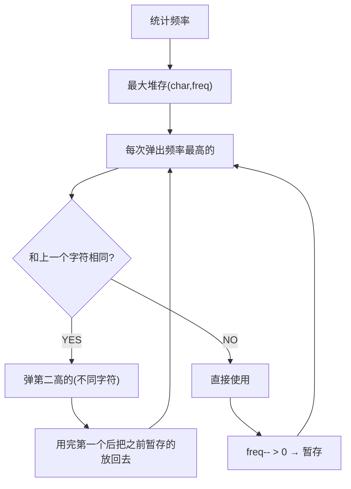

# 重构字符串（Reorganize String）

> LeetCode 767 · ⭐⭐ · 最大堆贪心

---

## 01. 题目

重排字符串使相邻字符不同。`"aab"` → `"aba"`；`"aaab"` → `""`（不可能）。

---

## 02. 题目分析

### 2.1 何时不可能？

若某字符频率 > (N+1)/2，则不可能。`"aaab"`：a频=3，总长4，(4+1)/2=2.5 → 3>2.5 → 不可能。

### 2.2 贪心策略



**为什么贪心正确？** 每次都选当前剩余最多且与上一个不同的字符，最大化未来的排列空间。

### 2.3 手推

```
s = "aab", freq = {a:2, b:1}

pq = [(a,2), (b,1)]

弹(a,2): sb='a', 暂存prev=(a,1)
弹(b,1): sb='ab', prev=(a,1)放回 → pq=[(a,1)]
弹(a,1): sb='aba', prev=(a,0)

结果: "aba" ✓
```

---

## 03. 代码

**Java**：
```java
public String reorganizeString(String s) {
    int[] f = new int[26];
    for (char c : s.toCharArray()) f[c - 'a']++;
    PriorityQueue<int[]> pq = new PriorityQueue<>((a, b) -> b[1] - a[1]);
    for (int i = 0; i < 26; i++) if (f[i] > 0) pq.offer(new int[]{i, f[i]});

    StringBuilder sb = new StringBuilder();
    int[] prev = {-1, 0};                           // 暂存上一个用过的字符
    while (!pq.isEmpty()) {
        int[] cur = pq.poll();
        sb.append((char)(cur[0] + 'a')); cur[1]--;
        if (prev[1] > 0) pq.offer(prev);            // 把暂存放回
        prev = cur;                                  // 当前成为新的暂存
    }
    return sb.length() == s.length() ? sb.toString() : "";
}
```

**Python**：
```python
def reorganizeString(self, s: str) -> str:
    from collections import Counter
    import heapq
    freq = Counter(s)
    pq = [(-v, k) for k, v in freq.items()]         # Python最大堆=取反
    heapq.heapify(pq)
    res, prev = [], (0, '')                          # prev=(剩余频次, 字符)

    while pq:
        v, k = heapq.heappop(pq)
        res.append(k)
        if prev[0] < 0: heapq.heappush(pq, prev)     # 放回暂存
        prev = (v + 1, k)                            # freq-1 (v是负数)

    return ''.join(res) if len(res) == len(s) else ''
```

**C++**：
```cpp
string reorganizeString(string s) {
    vector<int> f(26); for (char c : s) f[c-'a']++;
    auto cmp = [](pair<int,int>& a, pair<int,int>& b) { return a.second < b.second; };
    priority_queue<pair<int,int>, vector<pair<int,int>>, decltype(cmp)> pq(cmp);
    for (int i = 0; i < 26; i++) if (f[i] > 0) pq.push({i, f[i]});

    string ans; pair<int,int> prev = {-1, 0};
    while (!pq.empty()) {
        auto cur = pq.top(); pq.pop();
        ans += (char)(cur.first + 'a'); cur.second--;
        if (prev.second > 0) pq.push(prev);
        prev = cur;
    }
    return ans.size() == s.size() ? ans : "";
}
```

**复杂度**：O(Nlog26) ≈ O(N) / O(26)。

---

## 04. 总结

| 核心启示 | 说明 |
|---------|------|
| 最大堆 | 每次选剩余最多的不同字符 |
| 暂存(prev) | 本轮用了但仍有剩余的字符，下轮放回堆 |
| 不可行判定 | 某字符频率 > (N+1)/2 |

**相关题目**：[094 任务调度器](094.任务调度器.md)
