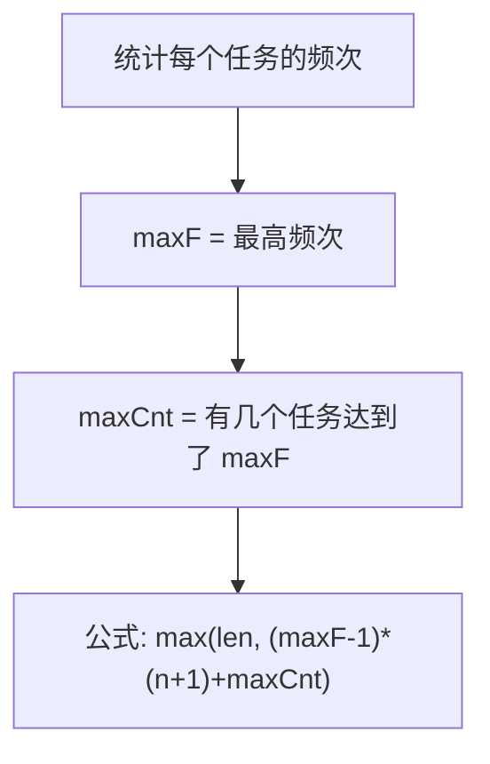
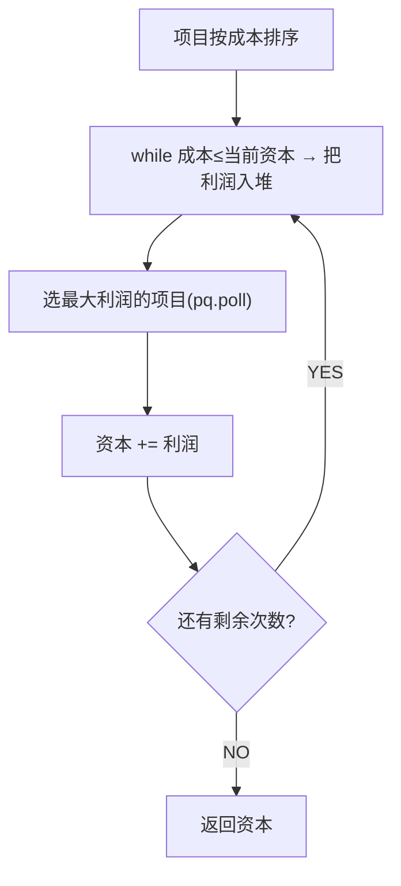

# 任务调度器 (621) / IPO (502)

---

## F009 任务调度器

> LeetCode 621 · ⭐⭐ · 桶思想

### 01. 题目

相同任务需间隔 n 个单位。`tasks=["A","A","A","B","B","B"], n=2` → 8。

### 02. 题解分析



**桶模型**：最高频任务形成 `(maxF-1)` 个完整桶，每个桶大小 `n+1`。最后一桶只放 maxCnt 个最高频任务。

```
A A A
B B B    n=2

桶1: A B idle  (周期=3=n+1)
桶2: A B idle  
最后: A B

总: 2×(2+1) + 2 = 8
公式: (3-1)×3 + 2 = 8
```

### 03. 代码

```java
public int leastInterval(char[] tasks, int n) {
    int[] f = new int[26];
    for (char c : tasks) f[c - 'A']++;
    int maxF = 0, maxCnt = 0;
    for (int x : f) {
        if (x > maxF) { maxF = x; maxCnt = 1; }
        else if (x == maxF) maxCnt++;
    }
    return Math.max(tasks.length, (maxF - 1) * (n + 1) + maxCnt);
}
```

**Python**：
```python
def leastInterval(self, tasks, n):
    from collections import Counter
    f = list(Counter(tasks).values())
    m = max(f); cnt = f.count(m)
    return max(len(tasks), (m - 1) * (n + 1) + cnt)
```

**复杂度**：O(N)/O(1)。

---

## F010 IPO

> LeetCode 502 · ⭐⭐⭐ · 贪心+堆

### 01. 题目

初始资本 w，选 ≤ k 个项目。每个项目有成本 c 和利润 p。最大化最终资本。

### 02. 分析



### 03. 代码

**Java**：
```java
public int findMaximizedCapital(int k, int w, int[] p, int[] c) {
    int n = p.length;
    int[][] arr = new int[n][2];
    for (int i = 0; i < n; i++) arr[i] = new int[]{c[i], p[i]};
    Arrays.sort(arr, (a, b) -> a[0] - b[0]);           // 按成本排序
    PriorityQueue<Integer> pq = new PriorityQueue<>(Collections.reverseOrder());

    int i = 0;
    while (k-- > 0) {
        while (i < n && arr[i][0] <= w)                 // 能买得起的全入堆
            pq.offer(arr[i++][1]);
        if (pq.isEmpty()) break;                         // 没有可选的了
        w += pq.poll();                                  // 选利润最大的
    }
    return w;
}
```

**Python**：
```python
def findMaximizedCapital(self, k, w, profits, capital):
    import heapq
    arr = sorted(zip(capital, profits))
    pq = []; i = 0
    for _ in range(k):
        while i < len(arr) and arr[i][0] <= w:
            heapq.heappush(pq, -arr[i][1]); i += 1
        if not pq: break
        w += -heapq.heappop(pq)
    return w
```

**复杂度**：O(NlogN)/O(N)。

### 04. 两题对比

| | 任务调度器 | IPO |
|------|:---:|:---:|
| 核心 | 桶思想(O(N)) | 贪心+最大堆(O(NlogN)) |
| 堆用途 | — | 选最大利润 |
| 公式 | 数学推导 | 贪心迭代 |

**相关**：[093 重构字符串](093.重构字符串.md)、[086 第K大](086.数组中的第K个最大元素.md)
