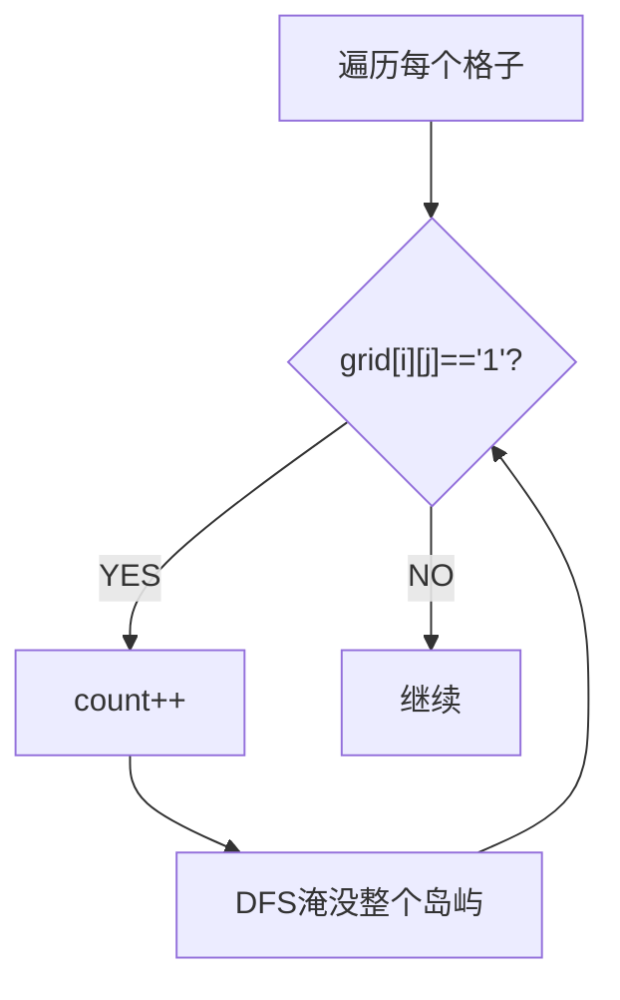

# 岛屿数量（Number of Islands）

> LeetCode 200 · ⭐⭐ · DFS/BFS/并查集

## 01. 题目

二维网格 `'1'` 陆地 `'0'` 水。相邻（上下左右）的 1 属于同一岛屿。计算岛屿数。

## 02. 分析

DFS 遍历每个 `'1'`，将其及相邻 1 全部沉没为 `'0'`。每触发一次 DFS → 一个岛屿。



## 03. 代码

**Java**：
```java
public int numIslands(char[][] grid) {
    int m = grid.length, n = grid[0].length, count = 0;
    for (int i = 0; i < m; i++)
        for (int j = 0; j < n; j++)
            if (grid[i][j] == '1') { dfs(grid, i, j); count++; }
    return count;
}
void dfs(char[][] g, int i, int j) {
    if (i < 0 || i >= g.length || j < 0 || j >= g[0].length || g[i][j] == '0') return;
    g[i][j] = '0';  // 沉没
    dfs(g, i+1, j); dfs(g, i-1, j); dfs(g, i, j+1); dfs(g, i, j-1);
}
```

**Python**：
```python
def numIslands(self, grid):
    m, n = len(grid), len(grid[0])
    def dfs(i, j):
        if i < 0 or i >= m or j < 0 or j >= n or grid[i][j] == '0': return
        grid[i][j] = '0'
        dfs(i+1, j); dfs(i-1, j); dfs(i, j+1); dfs(i, j-1)
    return sum(dfs(i, j) or 1 for i in range(m) for j in range(n) if grid[i][j] == '1')
```

**复杂度**：O(MN)/O(MN)。**相关**：[108 省份数量](108.省份数量.md)
