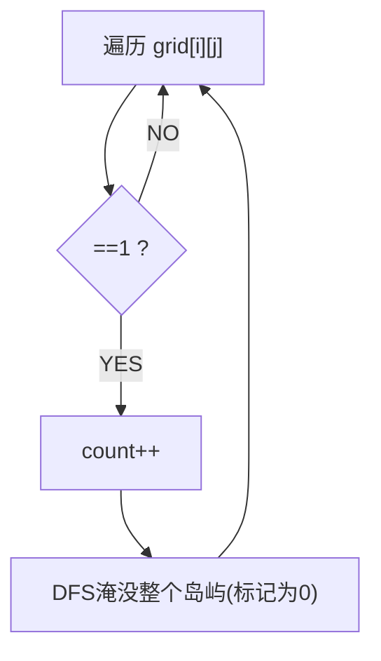

# 岛屿数量（Number of Islands）

> LeetCode 200 · ⭐⭐ · DFS/BFS/并查集
>
> 图的入门题。三种解法覆盖了图的三种核心算法思想：DFS"沉没"、BFS"扩散"、并查集"连通"。

---

## 01. 题目描述

二维网格 `'1'` 陆地 `'0'` 水。相邻（上下左右）的 1 属于同一岛屿。计算岛屿数量。

**示例**：
```
grid = [
  ["1","1","0","0","0"],
  ["1","1","0","0","0"],
  ["0","0","1","0","0"],
  ["0","0","0","1","1"]
]
输出：3
```

---

## 02. 题目分析

### 2.1 核心：连通分量计数

每个岛屿 = 一个连通分量。找到所有 `'1'`，将其所属连通分量全部标记，计数+1。



### 2.2 三解法对比

| 解法 | 时间 | 空间 | 核心操作 |
|------|:---:|:---:|------|
| DFS | O(MN) | O(MN) | 递归沉没 |
| BFS | O(MN) | O(min(M,N)) | 队列扩散 |
| 并查集 | O(MN·α) | O(MN) | union 连通 |

---

## 03. 解法一：DFS 沉没法

```java
public int numIslands(char[][] grid) {
    int m = grid.length, n = grid[0].length, count = 0;
    for (int i = 0; i < m; i++)
        for (int j = 0; j < n; j++)
            if (grid[i][j] == '1') { dfs(grid, i, j); count++; }
    return count;
}
void dfs(char[][] g, int i, int j) {
    if (i < 0 || i >= g.length || j < 0 || j >= g[0].length || g[i][j] == '0') return;
    g[i][j] = '0';          // 沉没！
    dfs(g, i+1, j); dfs(g, i-1, j); dfs(g, i, j+1); dfs(g, i, j-1);
}
```

**Python**：
```python
def numIslands(self, grid):
    m, n = len(grid), len(grid[0])
    def dfs(i, j):
        if i<0 or i>=m or j<0 or j>=n or grid[i][j]=='0': return
        grid[i][j] = '0'
        dfs(i+1,j); dfs(i-1,j); dfs(i,j+1); dfs(i,j-1)
    return sum(dfs(i,j) or 1 for i in range(m) for j in range(n) if grid[i][j]=='1')
```

**C++**：
```cpp
int numIslands(vector<vector<char>>& g) {
    int m=g.size(), n=g[0].size(), cnt=0;
    function<void(int,int)> dfs=[&](int i,int j){ if(i<0||i>=m||j<0||j>=n||g[i][j]=='0') return; g[i][j]='0'; dfs(i+1,j);dfs(i-1,j);dfs(i,j+1);dfs(i,j-1); };
    for(int i=0;i<m;i++) for(int j=0;j<n;j++) if(g[i][j]=='1'){ dfs(i,j); cnt++; }
    return cnt;
}
```

**复杂度**：O(MN)/O(MN)。

## 04. 解法二：并查集

```java
public int numIslands(char[][] grid) {
    int m=grid.length, n=grid[0].length, zeros=0;
    UnionFind uf = new UnionFind(m * n);
    for(int i=0;i<m;i++) for(int j=0;j<n;j++){
        if(grid[i][j]=='0'){ zeros++; continue; }
        if(i+1<m&&grid[i+1][j]=='1') uf.union(i*n+j, (i+1)*n+j);
        if(j+1<n&&grid[i][j+1]=='1') uf.union(i*n+j, i*n+j+1);
    }
    return uf.count - zeros;
}
```

## 05. 总结

| 核心启示 | 说明 |
|---------|------|
| DFS沉没 | 访问过的1变为0，省去visited数组 |
| 沉没=标记 | 一次DFS标记整个连通分量 |
| 并查集应用 | 连通分量问题 = 并查集天然场景 |

**相关**：[100 克隆图](100.克隆图.md)、[108 省份数量](108.省份数量.md)
