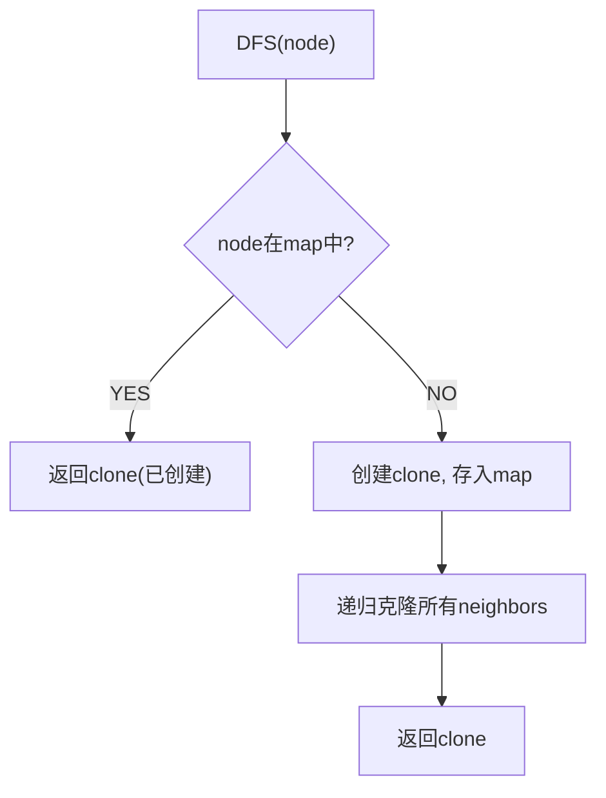

# 克隆图（Clone Graph）

> LeetCode 133 · ⭐⭐ · DFS/BFS+HashMap

## 01. 题目

深拷贝一个无向连通图。每个节点有 `val` 和 `List<Node> neighbors`。

## 02. 题目分析



**关键**：HashMap 存 `原节点 → 克隆节点` 防止重复创建和死循环。

## 03. 代码

**Java**：
```java
Map<Node, Node> map = new HashMap<>();
public Node cloneGraph(Node node) {
    if (node == null) return null;
    if (map.containsKey(node)) return map.get(node);
    Node clone = new Node(node.val);
    map.put(node, clone);
    for (Node neighbor : node.neighbors)
        clone.neighbors.add(cloneGraph(neighbor));
    return clone;
}
```

**Python**：
```python
def cloneGraph(self, node):
    if not node: return None
    mp = {}
    def dfs(n):
        if n in mp: return mp[n]
        clone = Node(n.val); mp[n] = clone
        for nb in n.neighbors: clone.neighbors.append(dfs(nb))
        return clone
    return dfs(node)
```

**C++**：
```cpp
unordered_map<Node*,Node*> mp;
Node* cloneGraph(Node* node) {
    if(!node) return nullptr;
    if(mp.count(node)) return mp[node];
    mp[node]=new Node(node->val);
    for(auto nb:node->neighbors) mp[node]->neighbors.push_back(cloneGraph(nb));
    return mp[node];
}
```

**复杂度**：O(V+E)/O(V)。

---

## 补充：被围绕的区域 (LeetCode 130)

从边界 `O` 开始DFS标记为 `T`。最后 `O→X`，`T→O`。

```java
public void solve(char[][] b) {
    int m=b.length,n=b[0].length;
    for(int i=0;i<m;i++){ dfs(b,i,0); dfs(b,i,n-1); }
    for(int j=0;j<n;j++){ dfs(b,0,j); dfs(b,m-1,j); }
    for(int i=0;i<m;i++) for(int j=0;j<n;j++) b[i][j]=b[i][j]=='T'?'O':'X';
}
void dfs(char[][] b,int i,int j){ if(i<0||i>=b.length||j<0||j>=b[0].length||b[i][j]!='O') return; b[i][j]='T'; dfs(b,i+1,j);dfs(b,i-1,j);dfs(b,i,j+1);dfs(b,i,j-1); }
```

**相关**：[096 岛屿数量](096.岛屿数量.md)
