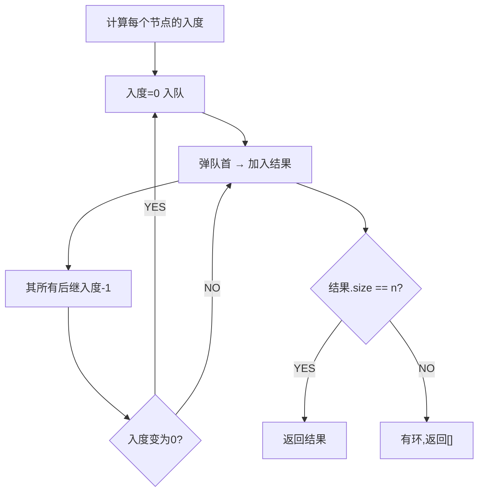

# 课程表 II（Course Schedule II）

> LeetCode 210 · ⭐⭐ · 拓扑排序

## 01. 题目

给定课程依赖 `[a,b]` 表示修 a 前必须先修 b。返回任意一种学习顺序，若存在环返回 `[]`。

```
numCourses=4, pre=[[1,0],[2,0],[3,1],[3,2]]
输出：[0,1,2,3] 或 [0,2,1,3]
```

## 02. 分析



**BFS拓扑排序 = 不断删除入度为0的节点**。若最终处理的节点数 < n，说明有环。

## 03. 代码

**Java**：
```java
public int[] findOrder(int n, int[][] pre) {
    List<Integer>[] adj = new List[n];
    for (int i = 0; i < n; i++) adj[i] = new ArrayList<>();
    int[] indeg = new int[n];
    for (int[] p : pre) { adj[p[1]].add(p[0]); indeg[p[0]]++; }

    Queue<Integer> q = new LinkedList<>();
    for (int i = 0; i < n; i++) if (indeg[i] == 0) q.offer(i);

    int[] res = new int[n]; int idx = 0;
    while (!q.isEmpty()) {
        int u = q.poll(); res[idx++] = u;
        for (int v : adj[u]) if (--indeg[v] == 0) q.offer(v);
    }
    return idx == n ? res : new int[0]; // 有环
}
```

**Python**：
```python
def findOrder(self, n, pre):
    adj = [[] for _ in range(n)]; indeg = [0] * n
    for a, b in pre: adj[b].append(a); indeg[a] += 1
    q = deque([i for i in range(n) if indeg[i] == 0])
    res = []
    while q:
        u = q.popleft(); res.append(u)
        for v in adj[u]:
            indeg[v] -= 1
            if indeg[v] == 0: q.append(v)
    return res if len(res) == n else []
```

**C++**：
```cpp
vector<int> findOrder(int n, vector<vector<int>>& pre) {
    vector<vector<int>> adj(n); vector<int> indeg(n);
    for(auto& p:pre){ adj[p[1]].push_back(p[0]); indeg[p[0]]++; }
    queue<int> q; for(int i=0;i<n;i++) if(!indeg[i]) q.push(i);
    vector<int> res;
    while(!q.empty()){ int u=q.front();q.pop(); res.push_back(u); for(int v:adj[u]) if(!--indeg[v]) q.push(v); }
    return res.size()==n?res:vector<int>();
}
```

**复杂度**：O(V+E)/O(V+E)。

**相关**：[103 Dijkstra](103.网络延迟时间.md)
