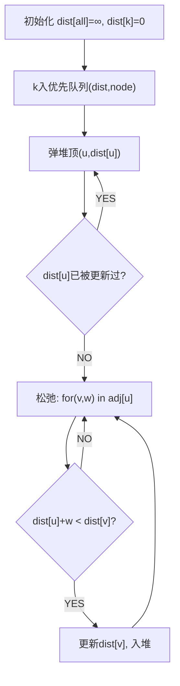

# 网络延迟时间（Network Delay Time）

> LeetCode 743 · ⭐⭐ · Dijkstra 最短路径

---

## 01. 题目描述

n 个节点（1~n），从 k 发送信号。`times[i]=[u,v,w]` 表示 u→v 耗时 w。求所有节点收到信号的最短时间（不可达返回-1）。

**示例**：
```
times = [[2,1,1],[2,3,1],[3,4,1]], n = 4, k = 2
输出：2
解释：2→1(1), 2→3(1), 3→4(1) → 最大=2
```

---

## 02. 题目分析

### Dijkstra 算法流程



**核心**：每次从堆中取出距离最小的节点，松弛它的所有出边。

---

## 03. 代码

**Java**：
```java
public int networkDelayTime(int[][] times, int n, int k) {
    // 建图
    List<int[]>[] adj = new List[n + 1];
    for (int i = 1; i <= n; i++) adj[i] = new ArrayList<>();
    for (int[] t : times) adj[t[0]].add(new int[]{t[1], t[2]});

    // Dijkstra
    int[] dist = new int[n + 1]; Arrays.fill(dist, Integer.MAX_VALUE);
    dist[k] = 0;
    PriorityQueue<int[]> pq = new PriorityQueue<>((a, b) -> a[1] - b[1]);
    pq.offer(new int[]{k, 0});

    while (!pq.isEmpty()) {
        int[] cur = pq.poll();
        int u = cur[0], d = cur[1];
        if (d > dist[u]) continue;                         // 过时数据跳过
        for (int[] e : adj[u]) {
            int v = e[0], w = e[1];
            if (dist[u] + w < dist[v]) {                   // 松弛
                dist[v] = dist[u] + w;
                pq.offer(new int[]{v, dist[v]});
            }
        }
    }

    int max = 0;
    for (int i = 1; i <= n; i++) {
        if (dist[i] == Integer.MAX_VALUE) return -1;
        max = Math.max(max, dist[i]);
    }
    return max;
}
```

**Python**：
```python
def networkDelayTime(self, times, n, k):
    import heapq
    adj = [[] for _ in range(n+1)]
    for u, v, w in times: adj[u].append((v, w))
    dist = [float('inf')] * (n+1); dist[k] = 0
    pq = [(0, k)]
    while pq:
        d, u = heapq.heappop(pq)
        if d > dist[u]: continue
        for v, w in adj[u]:
            if dist[u] + w < dist[v]:
                dist[v] = dist[u] + w; heapq.heappush(pq, (dist[v], v))
    ans = max(dist[1:])
    return -1 if ans == float('inf') else ans
```

**C++**：
```cpp
int networkDelayTime(vector<vector<int>>& times, int n, int k) {
    vector<vector<pair<int,int>>> adj(n+1);
    for(auto& t:times) adj[t[0]].emplace_back(t[1],t[2]);
    vector<int> dist(n+1,INT_MAX); dist[k]=0;
    priority_queue<pair<int,int>,vector<pair<int,int>>,greater<>> pq; pq.push({0,k});
    while(!pq.empty()){ auto[d,u]=pq.top();pq.pop(); if(d>dist[u]) continue;
        for(auto&[v,w]:adj[u]) if(dist[u]+w<dist[v]){ dist[v]=dist[u]+w; pq.push({dist[v],v}); } }
    int mx=*max_element(dist.begin()+1,dist.end());
    return mx==INT_MAX?-1:mx;
}
```

**复杂度**：O(ElogV)/O(V+E)。

## 04. 最短路算法对比

| 算法 | 适用 | 时间 | 空间 |
|------|------|:---:|:---:|
| Dijkstra | 非负权 | O(ElogV) | O(V+E) |
| Bellman-Ford | 可负权 | O(VE) | O(V) |
| BFS | 无权图 | O(V+E) | O(V) |

**相关**：[102 课程表II](102.课程表II.md)
