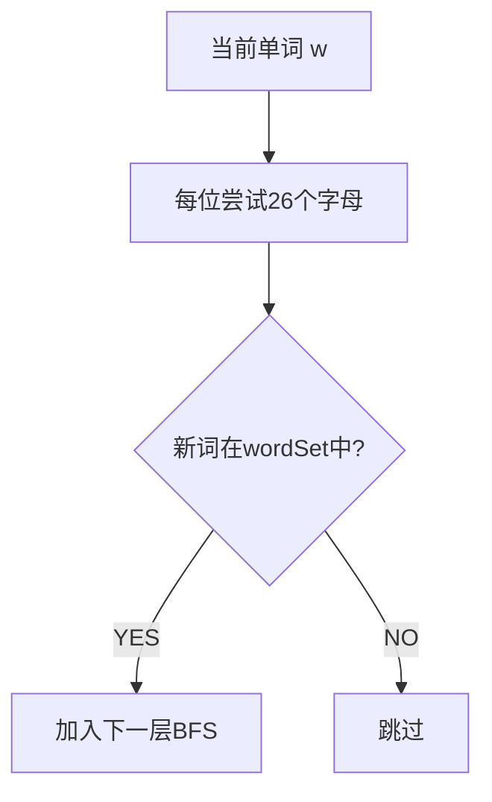

# 单词接龙（Word Ladder）

> LeetCode 127 · ⭐⭐⭐ · BFS + 隐式建图

---

## 01. 题目

每次变一个字母，从 beginWord 到 endWord 的最短转换序列长度。

```
begin="hit", end="cog", wordList=["hot","dot","dog","lot","log","cog"]
输出：5 (hit→hot→dot→dog→cog)
```

## 02. 题目分析

### 为什么是 BFS？

求最短路径 = 无权图 → BFS。每个单词是一个节点，相差一个字母的单词之间有边。

### 隐式建图



**不需要显式建邻接表**。对每个单词，枚举它的所有"一次变化邻居"，检查是否在集合中。O(N·L·26) << O(N²)。

## 03. 代码

**Java**：
```java
public int ladderLength(String begin, String end, List<String> wordList) {
    Set<String> set = new HashSet<>(wordList);
    if (!set.contains(end)) return 0;
    Queue<String> q = new LinkedList<>(); q.offer(begin);
    int level = 1;
    while (!q.isEmpty()) {
        for (int s = q.size(); s > 0; s--) {
            char[] cur = q.poll().toCharArray();
            for (int i = 0; i < cur.length; i++) {
                char old = cur[i];
                for (char c = 'a'; c <= 'z'; c++) {
                    if (c == old) continue; cur[i] = c;
                    String nxt = new String(cur);
                    if (nxt.equals(end)) return level + 1;
                    if (set.contains(nxt)) { set.remove(nxt); q.offer(nxt); }
                }
                cur[i] = old;
            }
        }
        level++;
    }
    return 0;
}
```

**Python**：
```python
def ladderLength(self, begin, end, wordList):
    ws = set(wordList)
    if end not in ws: return 0
    from collections import deque
    q, level = deque([begin]), 1
    while q:
        for _ in range(len(q)):
            w = list(q.popleft())
            for i in range(len(w)):
                old = w[i]
                for c in 'abcdefghijklmnopqrstuvwxyz':
                    if c == old: continue
                    w[i] = c; nxt = ''.join(w)
                    if nxt == end: return level + 1
                    if nxt in ws: ws.remove(nxt); q.append(nxt)
                w[i] = old
        level += 1
    return 0
```

**复杂度**：O(N·L·26)/O(N)，N为单词数，L为单词长度。

## 04. 优化方向

双向BFS：从begin和end同时搜索，相遇即找到最短路径。复杂度 O(N^(d/2))。

**相关**：[103 Dijkstra](103.网络延迟时间.md)、[102 课程表II](102.课程表II.md)
