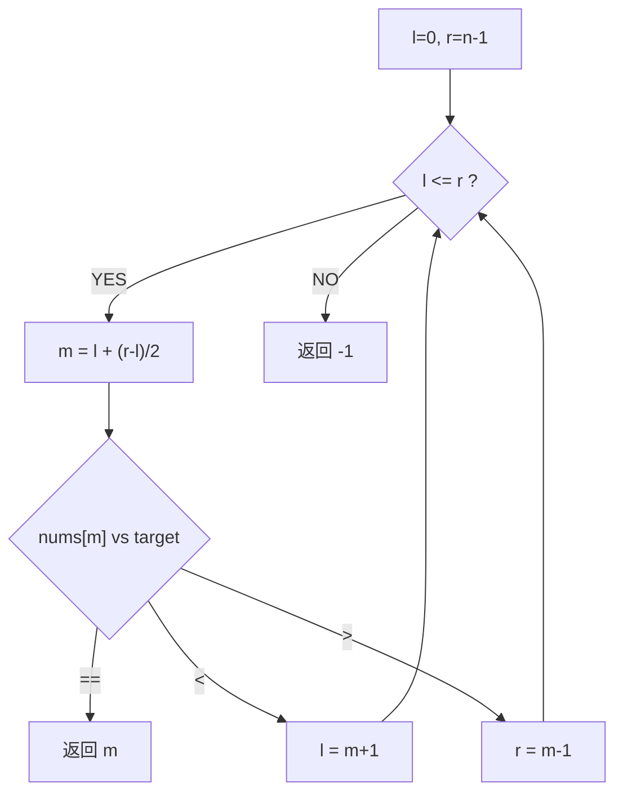

# 二分查找（Binary Search）

> LeetCode 704 · ⭐ · 二分根基
>
> 所有二分变体的母题。掌握这道题的三个关键细节，变体题迎刃而解。

---

## 01. 题目描述

在升序数组 `nums` 中查找 `target`，返回下标或 -1。

**示例**：
```
输入：nums = [-1,0,3,5,9,12], target = 9 → 输出：4
输入：nums = [-1,0,3,5,9,12], target = 2 → 输出：-1
```

---

## 02. 题目分析

### 2.1 核心框架



### 2.2 三个关键细节

| 细节 | 正确写法 | 为什么 |
|------|---------|--------|
| 中点 | `l + (r-l)/2` | 防 `(l+r)` 溢出 |
| 循环条件 | `while(l <= r)` | 单元素也能进入循环 |
| 边界更新 | `l=m+1`, `r=m-1` | 排除已检查的 m，防死循环 |

---

## 03. 代码

**Java**：
```java
public int search(int[] nums, int target) {
    int l = 0, r = nums.length - 1;
    while (l <= r) {
        int m = l + (r - l) / 2;
        if (nums[m] == target) return m;
        else if (nums[m] < target) l = m + 1;
        else r = m - 1;
    }
    return -1;
}
```

**Python**：
```python
def search(self, nums: List[int], target: int) -> int:
    l, r = 0, len(nums) - 1
    while l <= r:
        m = (l + r) // 2
        if nums[m] == target: return m
        elif nums[m] < target: l = m + 1
        else: r = m - 1
    return -1
```

**C++**：
```cpp
int search(vector<int>& nums, int target) {
    int l = 0, r = nums.size() - 1;
    while (l <= r) { int m = l + (r - l) / 2; if (nums[m] == target) return m; else if (nums[m] < target) l = m + 1; else r = m - 1; }
    return -1;
}
```

**复杂度**：O(logN)/O(1)。

---

## 04. 二分查找变体家族

```
基础二分 ─→ 搜索插入位置(112)
       ├─→ 左边界(113)
       ├─→ 右边界(113)
       ├─→ 旋转数组搜索(114)
       ├─→ 旋转数组最小值(116)
       ├─→ 两个有序数组中位数(118)
       ├─→ 平方根(119)
       └─→ 二分答案(120)

共同框架: while(l<=r) + m=l+(r-l)/2 + 有序判定
```

---

## 05. 总结

| 核心启示 | 说明 |
|---------|------|
| `l+(r-l)/2` | 永远用它，忘掉 `(l+r)/2` |
| `l<=r` | 保证处理到最后一个元素 |
| `m±1` | 必须排除已检查元素 |

**相关**：[112 搜索插入位置](112.搜索插入位置.md)、[113 查找边界](113.在排序数组中查找元素的第一个和最后一个位置.md)
