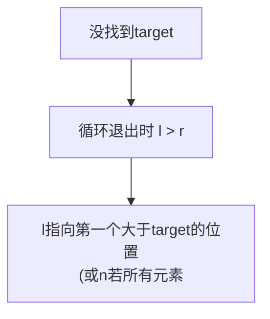

# 搜索插入位置（Search Insert Position）

> LeetCode 35 · ⭐ · 二分边界

## 01. 题目

`nums=[1,3,5,6], target=5` → 2；`target=2` → 1；`target=7` → 4

## 02. 题目分析

与基础二分完全相同，唯一区别：**未找到时返回 `l` 而不是 `-1`**。

### 为什么退出循环时 `l` 就是插入位置？



**证明**：二分过程中 `l` 只会向右移动（找更大的），`r` 向左移动（找更小的）。最终 `l` 停在第一个 `≥target` 的位置。

## 03. 代码

**Java**：
```java
public int searchInsert(int[] nums, int target) {
    int l = 0, r = nums.length - 1;
    while (l <= r) {
        int m = l + (r - l) / 2;
        if (nums[m] == target) return m;
        else if (nums[m] < target) l = m + 1;
        else r = m - 1;
    }
    return l;  // 唯一区别：返回l而非-1
}
```

**Python**：
```python
def searchInsert(self, nums, target):
    l, r = 0, len(nums) - 1
    while l <= r:
        m = (l + r) // 2
        if nums[m] == target: return m
        elif nums[m] < target: l = m + 1
        else: r = m - 1
    return l
```

**C++**：
```cpp
int searchInsert(vector<int>& nums, int target) {
    int l=0, r=nums.size()-1;
    while(l<=r){ int m=l+(r-l)/2; if(nums[m]==target) return m; else if(nums[m]<target) l=m+1; else r=m-1; }
    return l;
}
```

**复杂度**：O(logN)/O(1)。

**相关**：[111 基础二分](111.二分查找.md)、[113 查找边界](113.在排序数组中查找元素的第一个和最后一个位置.md)
