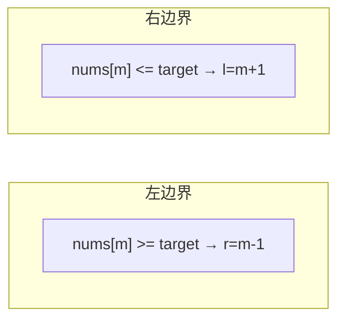

# 在排序数组中查找元素的第一个和最后一个位置

> LeetCode 34 · ⭐⭐ · 左右边界二分

## 01. 题目

`nums=[5,7,7,8,8,10], target=8` → `[3,4]`

## 02. 题目分析

### 左边界 vs 右边界



| | 左边界 | 右边界 |
|------|:---:|:---:|
| 移动条件 | `>= target` 时 `r=m-1` | `<= target` 时 `l=m+1` |
| 位置 | 第一个等于target | 最后一个等于target |
| 结果 | `ans` 记录命中时的 m | 同上 |

## 03. 代码

**Java**：
```java
public int[] searchRange(int[] nums, int target) {
    return new int[]{leftBound(nums, target), rightBound(nums, target)};
}
int leftBound(int[] nums, int t) {
    int l = 0, r = nums.length - 1, ans = -1;
    while (l <= r) {
        int m = l + (r - l) / 2;
        if (nums[m] >= t) { r = m - 1; if (nums[m] == t) ans = m; }
        else l = m + 1;
    }
    return ans;
}
int rightBound(int[] nums, int t) {
    int l = 0, r = nums.length - 1, ans = -1;
    while (l <= r) {
        int m = l + (r - l) / 2;
        if (nums[m] <= t) { l = m + 1; if (nums[m] == t) ans = m; }
        else r = m - 1;
    }
    return ans;
}
```

**Python**：
```python
def searchRange(self, nums, target):
    def left():
        l, r, a = 0, len(nums)-1, -1
        while l<=r:
            m=(l+r)//2
            if nums[m]>=target: r=m-1; a=m if nums[m]==target else a
            else: l=m+1
        return a
    def right():
        l, r, a = 0, len(nums)-1, -1
        while l<=r:
            m=(l+r)//2
            if nums[m]<=target: l=m+1; a=m if nums[m]==target else a
            else: r=m-1
        return a
    return [left(), right()]
```

**C++**：
```cpp
vector<int> searchRange(vector<int>& nums, int t) {
    auto left=[&]{ int l=0,r=nums.size()-1,a=-1; while(l<=r){ int m=l+(r-l)/2; if(nums[m]>=t){ r=m-1; if(nums[m]==t) a=m; } else l=m+1; } return a; };
    auto right=[&]{ int l=0,r=nums.size()-1,a=-1; while(l<=r){ int m=l+(r-l)/2; if(nums[m]<=t){ l=m+1; if(nums[m]==t) a=m; } else r=m-1; } return a; };
    return {left(),right()};
}
```

**复杂度**：O(logN)/O(1)。

**相关**：[111 基础二分](111.二分查找.md)、[112 搜索插入](112.搜索插入位置.md)
