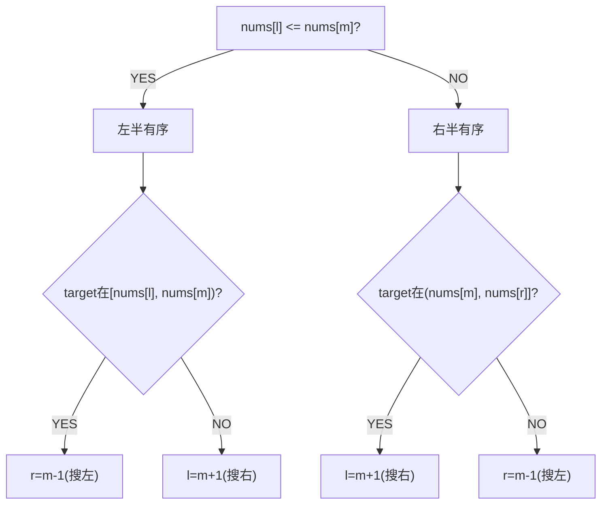

# 搜索旋转排序数组 / 含重复值

> LeetCode 33/81 · ⭐⭐ · 二分找有序段

## 114 旋转数组搜索 (33)

### 01. 题目

`nums=[4,5,6,7,0,1,2], target=0` → 4。O(logN)。

### 02. 分析

旋转数组 = 被pivot分成两段有序子数组。**每次迭代至少一半有序**。



### 03. 代码

**Java**：
```java
public int search(int[] nums, int target) {
    int l = 0, r = nums.length - 1;
    while (l <= r) {
        int m = l + (r - l) / 2;
        if (nums[m] == target) return m;
        if (nums[l] <= nums[m]) {                     // 左半有序
            if (nums[l] <= target && target < nums[m]) r = m - 1;
            else l = m + 1;
        } else {                                       // 右半有序
            if (nums[m] < target && target <= nums[r]) l = m + 1;
            else r = m - 1;
        }
    }
    return -1;
}
```

**Python**：
```python
def search(self, nums, target):
    l, r = 0, len(nums)-1
    while l <= r:
        m = (l+r)//2
        if nums[m] == target: return m
        if nums[l] <= nums[m]:
            if nums[l] <= target < nums[m]: r = m-1
            else: l = m+1
        else:
            if nums[m] < target <= nums[r]: l = m+1
            else: r = m-1
    return -1
```

**C++**：
```cpp
int search(vector<int>& nums, int target) {
    int l=0,r=nums.size()-1;
    while(l<=r){ int m=l+(r-l)/2; if(nums[m]==target) return m;
        if(nums[l]<=nums[m]){ if(nums[l]<=target&&target<nums[m]) r=m-1; else l=m+1; }
        else{ if(nums[m]<target&&target<=nums[r]) l=m+1; else r=m-1; }
    }
    return -1;
}
```

**复杂度**：O(logN)/O(1)。

## 115 含重复值 (81)

当 `nums[l]==nums[m]==nums[r]` 无法判断时 → `l++; r--`。最坏 O(N)。

```java
public boolean search(int[] nums, int target) {
    int l=0,r=nums.length-1;
    while(l<=r){ int m=l+(r-l)/2; if(nums[m]==target) return true;
        if(nums[l]==nums[m]&&nums[m]==nums[r]){ l++; r--; }
        else if(nums[l]<=nums[m]){ if(nums[l]<=target&&target<nums[m]) r=m-1; else l=m+1; }
        else{ if(nums[m]<target&&target<=nums[r]) l=m+1; else r=m-1; }
    }
    return false;
}
```

**相关**：[116 最小值](116.寻找旋转排序数组中的最小值.md)
