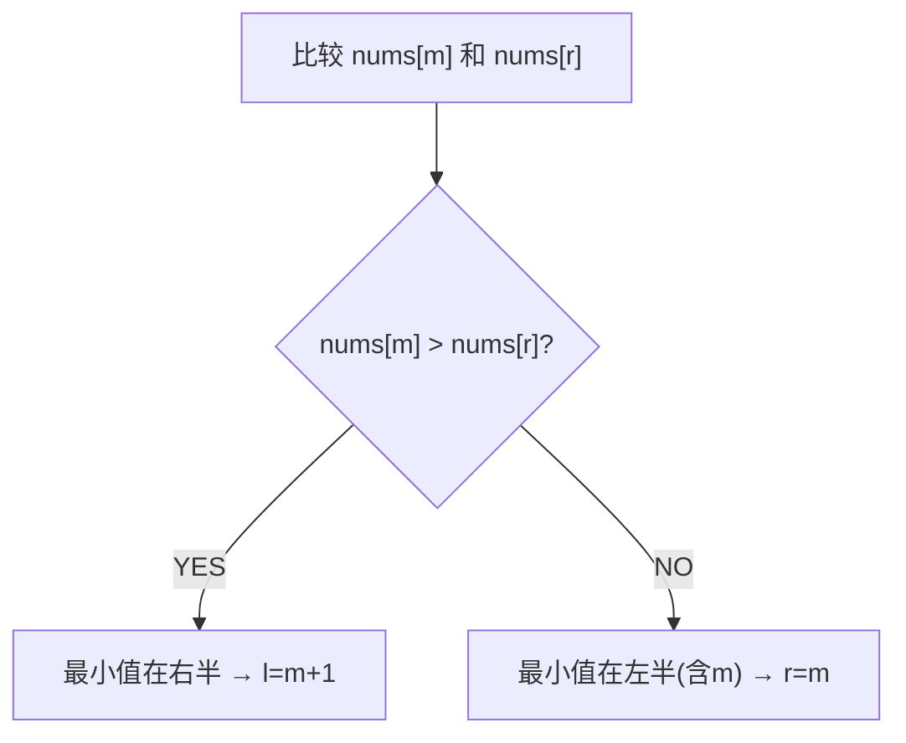

# 寻找旋转排序数组中的最小值 (153) / 寻找峰值 (162)

> LeetCode 153/162 · ⭐⭐ · 二分找拐点

## 116 旋转数组最小值 (153)

### 01. 题目

`[3,4,5,1,2]` → 1。无重复元素，O(logN)。

### 02. 分析



**关键**：`nums[m] > nums[r]` 说明最小值在 `[m+1, r]`。否则在 `[l, m]`。

### 03. 代码

```java
public int findMin(int[] nums) {
    int l = 0, r = nums.length - 1;
    while (l < r) {
        int m = l + (r - l) / 2;
        if (nums[m] > nums[r]) l = m + 1;
        else r = m;
    }
    return nums[l];
}
```

**Python**：
```python
def findMin(self, nums):
    l, r = 0, len(nums)-1
    while l < r:
        m = (l+r)//2
        if nums[m] > nums[r]: l = m+1
        else: r = m
    return nums[l]
```

**C++**：
```cpp
int findMin(vector<int>& nums) { int l=0,r=nums.size()-1; while(l<r){ int m=l+(r-l)/2; if(nums[m]>nums[r]) l=m+1; else r=m; } return nums[l]; }
```

**复杂度**：O(logN)/O(1)。

## H007 寻找峰值 (162)

峰值：`nums[i] > nums[i-1] && nums[i] > nums[i+1]`（边界外为 -∞）。

```java
public int findPeakElement(int[] nums) {
    int l = 0, r = nums.length - 1;
    while (l < r) {
        int m = l + (r - l) / 2;
        if (nums[m] > nums[m + 1]) r = m;   // 峰值在左(含m)
        else l = m + 1;                       // 峰值在右
    }
    return l;
}
```

**二分爬坡**：哪边更高就往哪边走，O(logN) 必能找到峰值。

**Python**：
```python
def findPeakElement(self, nums):
    l, r = 0, len(nums)-1
    while l < r:
        m = (l+r)//2
        if nums[m] > nums[m+1]: r = m
        else: l = m+1
    return l
```

**相关**：[114 旋转搜索](114.搜索旋转排序数组.md)
