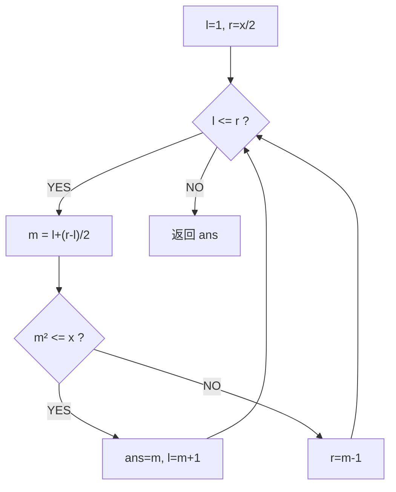

# x 的平方根（Sqrt(x)）

> LeetCode 69 · ⭐ · 二分 / 牛顿迭代

---

## 01. 题目

计算 x 的算术平方根（只保留整数）。`x=8` → 2。

---

## 02. 题目分析

### 解法一：二分查找

在 `[1, x/2]` 内二分找 `m² ≤ x` 的最大 m。



### 解法二：牛顿迭代

$$x_{n+1} = \frac{x_n + a/x_n}{2}$$

收敛极快（二次收敛），约 5 次迭代即可。

---

## 03. 代码

**Java**（二分）：
```java
public int mySqrt(int x) {
    if (x < 2) return x;
    int l = 1, r = x / 2, ans = 0;
    while (l <= r) {
        int m = l + (r - l) / 2;
        if ((long) m * m <= x) { ans = m; l = m + 1; }
        else r = m - 1;
    }
    return ans;
}
```

**Java**（牛顿法）：
```java
public int mySqrt(int x) {
    if (x == 0) return 0;
    long r = x;
    while (r * r > x) r = (r + x / r) / 2;
    return (int) r;
}
```

**Python**（二分）：
```python
def mySqrt(self, x: int) -> int:
    if x < 2: return x
    l, r, ans = 1, x // 2, 0
    while l <= r:
        m = (l + r) // 2
        if m * m <= x: ans = m; l = m + 1
        else: r = m - 1
    return ans
```

**C++**（二分）：
```cpp
int mySqrt(int x) { if(x<2) return x; int l=1,r=x/2,a=0; while(l<=r){ int m=l+(r-l)/2; if((long)m*m<=x){ a=m; l=m+1; } else r=m-1; } return a; }
```

**复杂度**：二分 O(logN)，牛顿法 O(logN)但常数极小。

---

## 04. 二分 vs 牛顿

| | 二分 | 牛顿 |
|------|:---:|:---:|
| 时间复杂度 | O(logN) | 约 O(loglogN) |
| 实现难度 | 简单 | 简单 |
| 面试推荐 | ✅ | ✅ 加分 |

**相关**：[120 分割数组最大值](120.分割数组的最大值.md)
