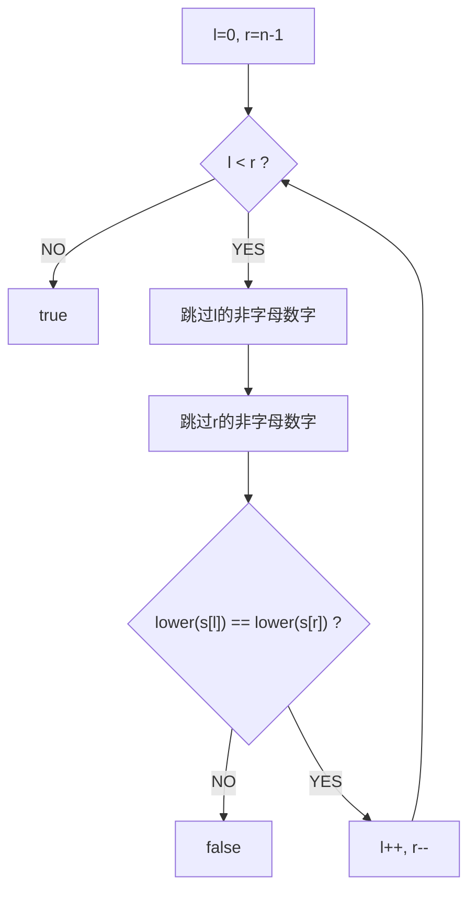

# 验证回文串（Valid Palindrome）

> LeetCode 125 · ⭐ · 双指针

---

## 01. 题目描述

只考虑字母和数字字符，忽略大小写。判断是否为回文。

**示例**：
```
输入："A man, a plan, a canal: Panama"  → true  ("amanaplanacanalpanama")
输入："race a car"                       → false
```

---

## 02. 题目分析

### 2.1 双指针夹逼



### 2.2 技巧

`Character.isLetterOrDigit()` 只保留字母和数字。`Character.toLowerCase()` 统一转小写。

---

## 03. 代码

**Java**：
```java
public boolean isPalindrome(String s) {
    int l = 0, r = s.length() - 1;
    while (l < r) {
        while (l < r && !Character.isLetterOrDigit(s.charAt(l))) l++;
        while (l < r && !Character.isLetterOrDigit(s.charAt(r))) r--;
        if (Character.toLowerCase(s.charAt(l)) != Character.toLowerCase(s.charAt(r)))
            return false;
        l++; r--;
    }
    return true;
}
```

**Python**：
```python
def isPalindrome(self, s: str) -> bool:
    s = ''.join(c.lower() for c in s if c.isalnum())
    return s == s[::-1]
```

**C++**：
```cpp
bool isPalindrome(string s) {
    int l=0, r=s.size()-1;
    while(l<r){ while(l<r&&!isalnum(s[l])) l++; while(l<r&&!isalnum(s[r])) r--; if(tolower(s[l])!=tolower(s[r])) return false; l++; r--; }
    return true;
}
```

**复杂度**：O(N)/O(1)。

---

## 04. 总结

| 核心技巧 | 说明 |
|---------|------|
| 双指针夹逼 | 两端向中间收缩 |
| 过滤非字母数字 | `isLetterOrDigit` / `isalnum` |
| 忽略大小写 | `toLowerCase` / `tolower` |

**相关题目**：[123 反转字符串](123.反转字符串.md)
