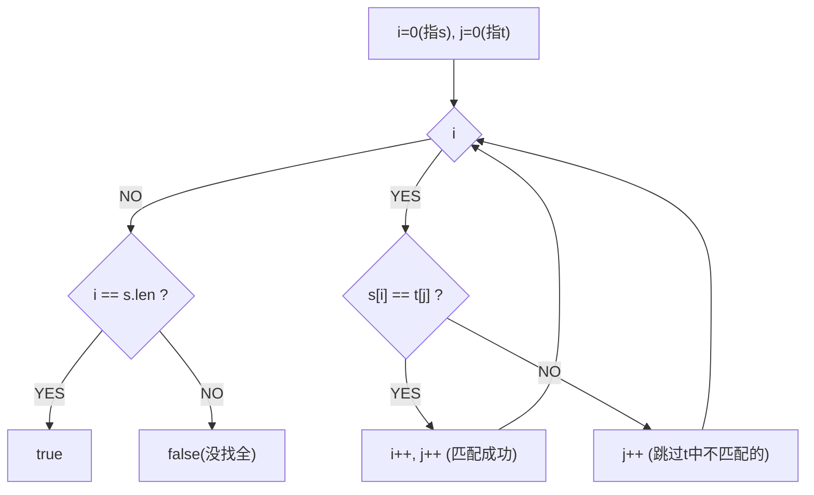

# 判断子序列（Is Subsequence）

> LeetCode 392 · ⭐ · 双指针

---

## 01. 题目描述

判断 `s` 是否为 `t` 的子序列（不要求连续，但相对顺序不变）。

**示例**：
```
输入：s="abc", t="ahbgdc"    → true
输入：s="axc", t="ahbgdc"    → false
```

---

## 02. 题目分析

### 双指针追及



`i` 指向 s 中待匹配字符，`j` 扫描 t。匹配成功时 i 前进，j 一直前进。

### 进阶：大量 s 查询

如果有 k 个 s 要判断，每次 O(N) 太慢。预处理 t 的字符位置列表，用二分加速到 O(logN)。

---

## 03. 代码

**Java**：
```java
public boolean isSubsequence(String s, String t) {
    int i = 0, j = 0;
    while (i < s.length() && j < t.length()) {
        if (s.charAt(i) == t.charAt(j)) i++;
        j++;
    }
    return i == s.length();
}
```

**Python**：
```python
def isSubsequence(self, s: str, t: str) -> bool:
    i = 0
    for c in t:
        if i < len(s) and s[i] == c: i += 1
    return i == len(s)
```

**C++**：
```cpp
bool isSubsequence(string s, string t) {
    int i=0;
    for(int j=0;i<s.size()&&j<t.size();j++)
        if(s[i]==t[j]) i++;
    return i==s.size();
}
```

**复杂度**：O(N)/O(1)。

---

## 04. 总结

| 核心 | 说明 |
|------|------|
| 双指针追及 | i 追 s，j 扫 t |
| 关键条件 | `s[i]==t[j]` 匹配成功 i++ |
| 进阶 | 预处理+二分支持多查询 |

**相关题目**：[121 回文串](121.验证回文串.md)
