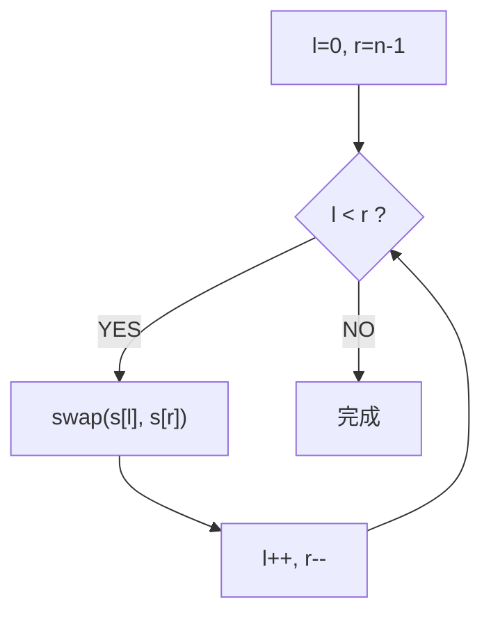

# 反转字符串（Reverse String）

> LeetCode 344 · ⭐ · 双指针原地交换

---

## 01. 题目描述

原地反转字符数组。

**示例**：
```
输入：['h','e','l','l','o']  →  ['o','l','l','e','h']
```

---

## 02. 题目分析

### 双指针原地交换



---

## 03. 代码

**Java**：
```java
public void reverseString(char[] s) {
    for (int l = 0, r = s.length - 1; l < r; l++, r--) {
        char t = s[l]; s[l] = s[r]; s[r] = t;
    }
}
```

**Python**：
```python
def reverseString(self, s: List[str]) -> None:
    s.reverse()
```

**C++**：
```cpp
void reverseString(vector<char>& s) {
    for(int l=0,r=s.size()-1;l<r;l++,r--) swap(s[l],s[r]);
}
```

**复杂度**：O(N)/O(1)。

---

## 04. 双指针题型速查

| 类型 | 题目 | 指针移动 |
|------|------|---------|
| 两端夹逼 | 121 回文 / 123 反转 | `l++, r--` 同步 |
| 同向追及 | 122 子序列 | `j` 始终前进，`i` 匹配才进 |
| 左右夹逼 | A005 盛水 / A006 接雨 | 哪边矮移哪边 |
| 平方数 | 126 平方数之和 | `l²+r² vs c` 决定方向 |

---

## 05. 总结

| 核心启示 | 说明 |
|---------|------|
| 原地反转 | 双指针首尾交换，无需额外空间 |
| 双指针本质 | 用两端向中间的方式将 O(N) 空间降到 O(1) |

**相关题目**：[121 回文串](121.验证回文串.md)、[A005 盛水容器](../07.数组算法题/005.盛最多水的容器.md)
